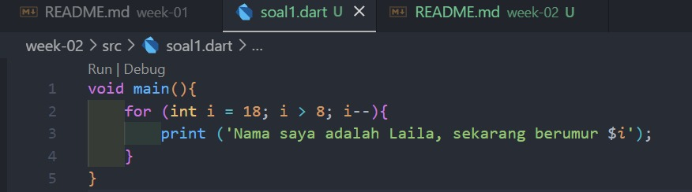
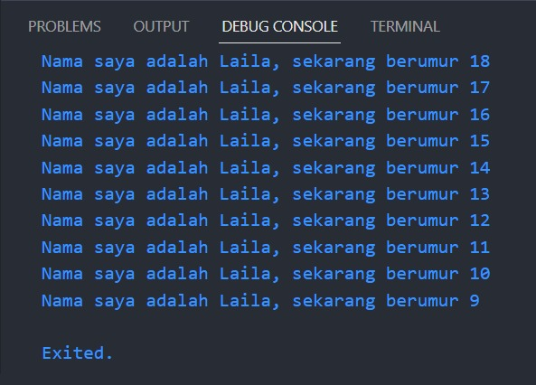

# Pemrograman Mobile

## Project Pengantar Bahasa Pemrograman Dart - Bagian 1

- **Nama:** Lailatul Badriyah
- **NIM:** 2141720036
- **Kelas:** TI-3H
- **No Absen:** 14

## Soal 1: Memodifikasi kode menjadi output yang diminta
### Jawaban:
### Code

### Output

## Soal 2: Mengapa sangat penting untuk memahami bahasa pemrograman Dart sebelum kita menggunakan framework Flutter ? Jelaskan!

### Jawaban:
Memahami bahasa pemrograman Dart sebelum menggunakan framework Flutter sangat penting karena Dart merupakan bahasa intu yang digunakan dalam pengembangan aplikasi dengan Flutter. Sehingga pemahaman yang kuat mengenai Dart diperlukan untuk menghindari masalah kinerja, memudahkan debugging, mengizinkan kustomisasi, dan meningkatkan kemampuan pengembangan aplikasi Flutter secara keseluruhan. Oleh karena itu, dengan pemahaman Dart yang baik, maka kita dapat lebih efektif dan kompeten dalam mengembangkan aplikasi Flutter yang berkualitas.

## Soal 3: Rangkumlah materi dari codelab ini menjadi poin-poin penting yang dapat Anda gunakan untuk membantu proses pengembangan aplikasi mobile menggunakan framework Flutter.

### Jawaban:
**Dart** adalah sebagai bahasa utama dalam pengembangan aplikasi Flutter.

**Kelebihan Dart**
1. **Productive tooling**: Fitur untuk menganalisis kode, plugin IDE, dan ekosistem library yang besar.
2. **Garbage collection**: Fitur untuk mengelola memori yang tidak lagi digunakan untuk memastikan aplikasi tetap efisien.
3. **Type annotations (opsional)**: Untuk keamanan dan konsistensi dalam mengontrol data dalam aplikasi.
4. **Statically typed**: Menggunakan fitur type-safe dan type inference untuk mencegah bug pada saat kompilasi kode.
5. **Portabilitas**: Bahasa Dart tidak hanya untuk web tapi juga dapat decompile secara native berbagai platform seperti ARM dan x86.

**Cara Kerja Dart**

**Dart VM and JavaScript compilation**
Kode Dart dapat dieksekusi pada lingkungan yang mendukung bahasa Dart dengan memperhatikan fitur-fitur berikut:
1. Runtime systems
2. Dart core libraries
3. Garbage Collector

Eksekusi kode Dart dapat dilakukan dalam 2 metode yaitu:
1. **Kompilasi JIT**: Saat kode Dart dikompilasi saat diperlukan, digunakan dalam pengembangan aplikasi untuk debugging dan hot reload
2. **Kompilasi AOT**: Melibatkan kompilasi sebelumnya untuk performa yang lebih tinggi, tetapi tanpa fitur debugging dan hot reload.

**Operator Dasar Dart**

Operator dasar dalam bahasa pemrograman Dart mirip dengan operator dasar yang biasa digunakan dalam bahasa pemrograman lainnya. Di bawah ini adalah beberapa operator dasar yang sering dipakai dalam Dart:
1. **Operator Aritmatika:**
    - `+` (Penambahan)
    - `-` (Pengurangan)
    - `*` (Perkalian)
    - `/` (Pembagian)
    - `~/` (Pembagian bilangan bulat)
    - `%` (Modulus)
    - `-expression` (Negasi)

2. **Operator Increment dan Decrement**
    - `++var` atau `var++` (Menambah nilai variabel `var` sebesar 1)
    - `--var` atau `var--` (Mengurangi nilai variabel `var` sebesar 1)

3. **Operator Perbandingan**
    - `==` (Sama dengan)
    - `!=` (Tidak sama dengan)
    - `<` (Kurang dari)
    - `>` (Lebih dari)
    - `<=` (Kurang dari atau sama dengan)
    - `>=` (Lebih dari atau sama dengan)

4. **Operator Logika**
    - `$$` (Logika AND)
    - `||` (Logika OR)
    - `!` (Logika NOT)

## Soal 4: Buatlah slide yang berisi penjelasan dan contoh eksekusi kode tentang perbedaan Null Safety dan Late variabel !

### Jawaban:
https://www.canva.com/design/DAFtcpN9KYY/C2O4GmN01zV6NxRoYV_30Q/view?utm_content=DAFtcpN9KYY&utm_campaign=designshare&utm_medium=link&utm_source=publishsharelink

