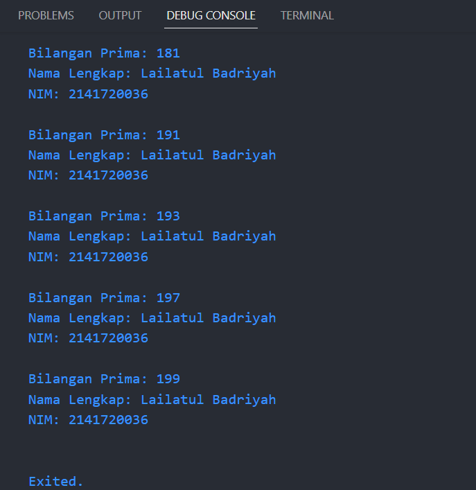

# Pemrograman Mobile

## Project Pengantar Bahasa Pemrograman Dart - Bagian 3

- **Nama:** Lailatul Badriyah
- **NIM:** 2141720036
- **Kelas:** TI-3H
- **No Absen:** 14

## **Praktikum 1**
### Langkah 1:
Ketik atau salin kode program berikut ke dalam fungsi main().
```javascript
String test = "test2";
if (test == "test1") {
   print("Test1");
} else If (test == "test2") {
   print("Test2");
} Else {
   print("Something else");
}

if (test == "test2") print("Test2 again");
```
### Jawaban:
### Code dan Output


### Langkah 2:
Silakan coba eksekusi (Run) kode pada langkah 1 tersebut. Apa yang terjadi? Jelaskan!
### Jawaban:
Setelah dieksekusi, kode pada langkah 1 menampilkan error. Karena pada kode terdapat beberapa kesalahan dalam sintaksis yang perlu diperbaiki sebelum kode tersebut dapat dieksekusi dengan benar.

### Langkah 3:
Tambahkan kode program berikut, lalu coba eksekusi (Run) kode Anda.
```javascript
String test = "true";
if (test) {
   print("Kebenaran");
}
```
Apa yang terjadi ? Jika terjadi error, silakan perbaiki namun tetap menggunakan if/else.
### Jawaban:
### Code dan Output


Setelah ditambahkan kode di atas, masih terdapat eror. Berikut adalah kode yang telah diperbaiki:
### Code dan Output Perbaikan


## **Praktikum 2**
### Langkah 1:
Ketik atau salin kode program berikut ke dalam fungsi main().
```javascript
while (counter < 33) {
  print(counter);
  counter++;
}
```
### Jawaban:
### Code dan Output


### Langkah 2:
Silakan coba eksekusi (Run) kode pada langkah 1 tersebut. Apa yang terjadi? Jelaskan! Lalu perbaiki jika terjadi error.
### Jawaban:
Setelah dieksekusi kode pada langkah 1 menampilkan eror. Karena harus menginisialisasi variabel counter terlebih dahulu sebelum menggunakannya dalam loop while. Pada perbaikan kode, saya telah menambahkan inisialisasi int counter = 0; sebelum loop while. Hasil eksekusi kode tersebut akan mencetak angka 0 hingga 32. Berikut adalah kode yang telah diperbaiki:
### Code dan Output Perbaikan


### Langkah 3:
Tambahkan kode program berikut, lalu coba eksekusi (Run) kode Anda.
```javascript
do {
  print(counter);
  counter++;
} while (counter < 77);
```
Apa yang terjadi ? Jika terjadi error, silakan perbaiki namun tetap menggunakan do-while.
### Jawaban:
Yang terjadi adalah kodenya sudah berfungsi dengan baik dan tidak menampilkan eror. Pada kode di atas, variabel counter diinisialisasi ke nilai 0 sebelum digunakan dalam loop do-while. Selama kondisi counter < 77 benar (true), pernyataan dalam blok do akan dijalankan. Oleh karena itu, loop akan mencetak angka dari 0 hingga 76 sebelum berhenti.
### Code dan Output


## **Praktikum 3**
### Langkah 1:
Ketik atau salin kode program berikut ke dalam fungsi main().
```javascript
for (Index = 10; index < 27; index) {
  print(Index);
}
```
### Jawaban:
### Code dan Output


### Langkah 2:
Silakan coba eksekusi (Run) kode pada langkah 1 tersebut. Apa yang terjadi? Jelaskan! Lalu perbaiki jika terjadi error.
### Jawaban:
Setelah dieksekusi kode pada langkah 1 menampilkan eror. Karena terdapat kesalahan  penulisan variabel Index. Nama variabel harus diawali dengan huruf kecil. Selain itu, perlu ditambahkan ekspresi iterasi yang mengubah nilai variabel Index sehingga loop dapat berhenti dan tidak menyebabkan iterasi yang tak berujung. Dalam kode di atas, saya mengubah nama variabel Index menjadi index, dan saya menambahkan ekspresi iterasi index++ sehingga variabel index akan terus bertambah setiap kali iterasi dilakukan. Kode ini akan mencetak angka dari 10 hingga 26. Berikut adalah kode yang telah diperbaiki:
### Code dan Output Perbaikan


### Langkah 3:
Tambahkan kode program berikut di dalam for-loop, lalu coba eksekusi (Run) kode Anda.
```javascript
If (Index == 21) break;
Else If (index > 1 || index < 7) continue;
print(index);
```
Apa yang terjadi ? Jika terjadi error, silakan perbaiki namun tetap menggunakan for dan break-continue.
### Jawaban:
### Code dan Output


Yang terjadi adalah kodenya masih eror. Karena kesalahan penulisan sintaks yang tidak sesuai aturan, jama variabel Index harus diubah menjadi index dengan huruf kecil.
Penggunaan kata kunci Else If harus diubah menjadi else if dengan huruf kecil. Berikut adalah kode yang telah diperbaiki:


Setelah kode diperbaiki, program dapat dijalankan, tetapi tidak mengeluarkan output karena hasil dari logika tersebut mengharuskan perulangan selalu mengarah ke break event. Oleh karena itu, saya mengganti || menjadi &&. Sehingga akan mencetak angka dari 10 hingga 20, kemudian akan langsung keluar dari loop ketika index sama dengan 21, dan akan mengabaikan nilai-nilai index antara 1 dan 6.Berikut adalah kode yang telah diperbaiki:


## **Tugas Praktikum**
Buatlah sebuah program yang dapat menampilkan bilangan prima dari angka 0 sampai 201 menggunakan Dart. Ketika bilangan prima ditemukan, maka tampilkan nama lengkap dan NIM Anda.

### Jawaban:
### Code

### Output
