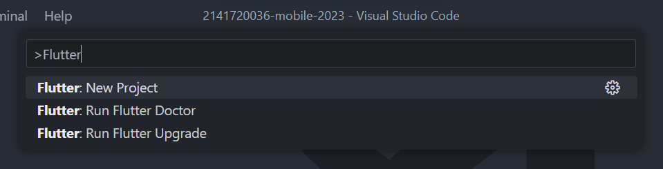
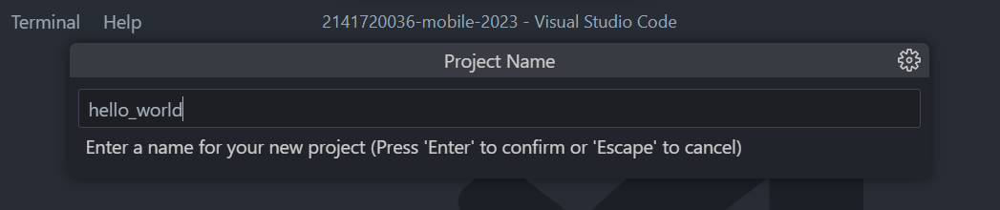
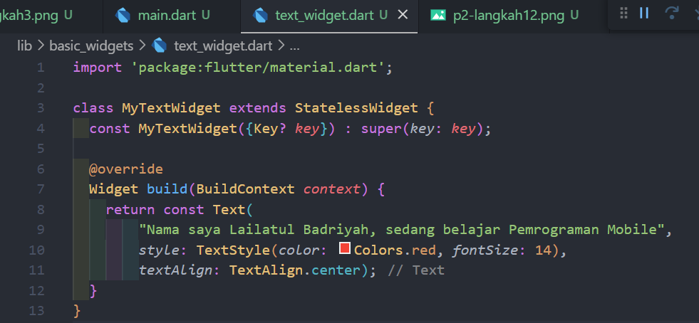
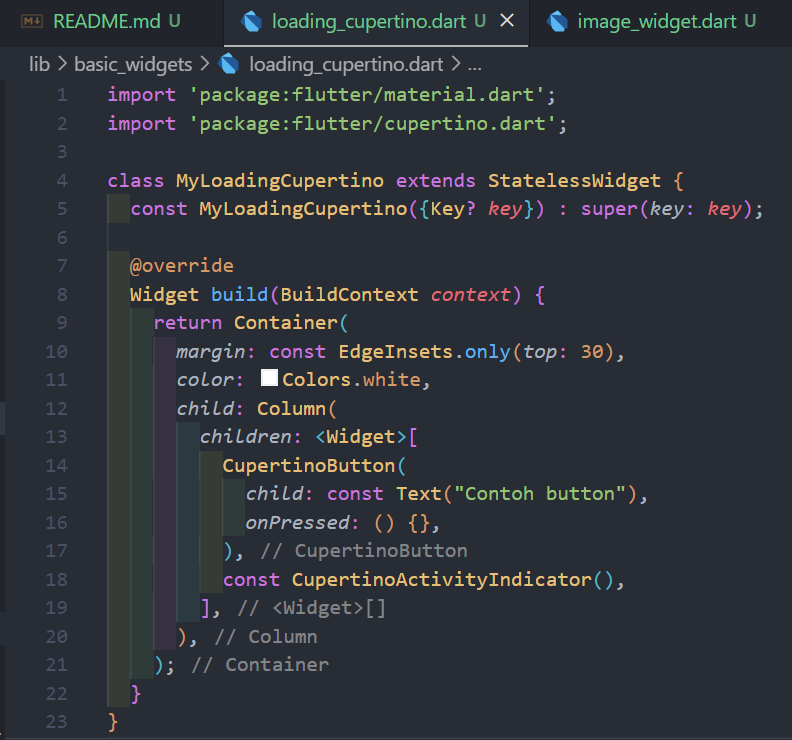
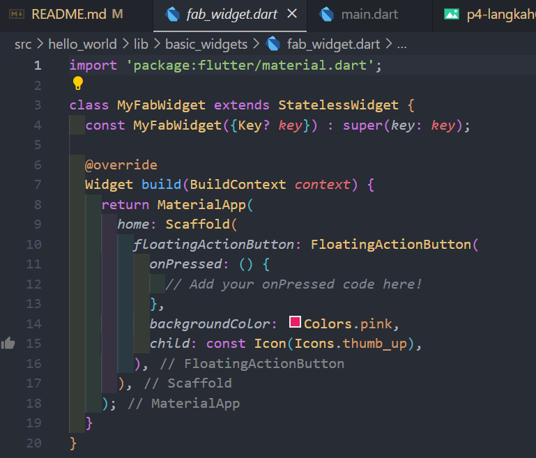
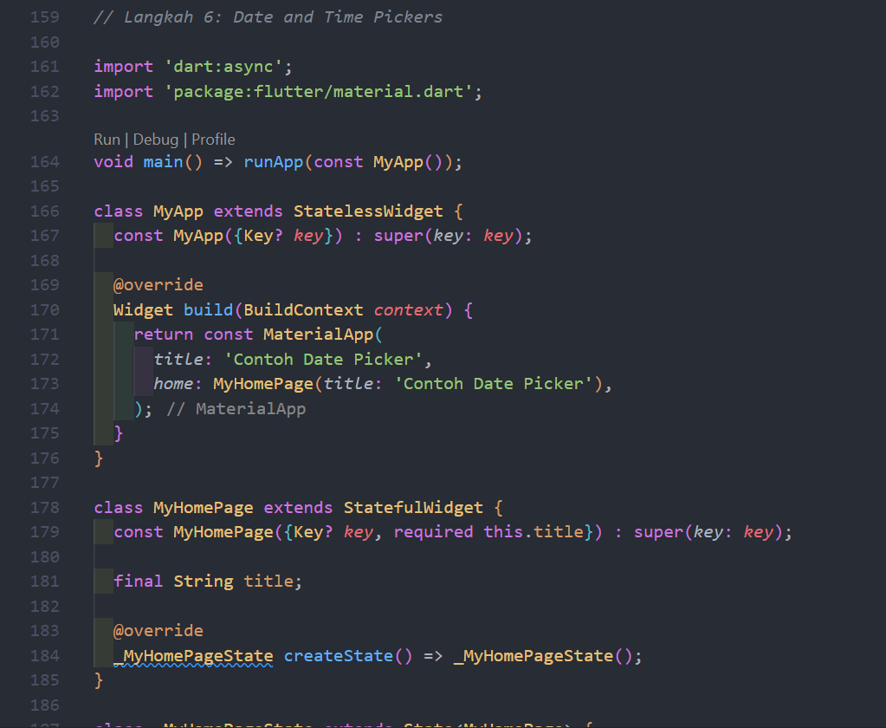

# Pemrograman Mobile

## Project Pengantar Bahasa Pemrograman Dart - Bagian 4

- **Nama:** Lailatul Badriyah
- **NIM:** 2141720036
- **Kelas:** TI-3H
- **No Absen:** 14

## **Praktikum 1: Eksperimen Tipe Data List**
### Langkah 1:
Ketik atau salin kode program berikut ke dalam void main().
```javascript
var list = [1, 2, 3];
assert(list.length == 3);
assert(list[1] == 2);
print(list.length);
print(list[1]);

list[1] = 1;
assert(list[1] == 1);
print(list[1]);
```
### Jawaban:
### Code dan Output


### Langkah 2:
Silakan coba eksekusi (Run) kode pada langkah 1 tersebut. Apa yang terjadi? Jelaskan!
### Jawaban:
Setelah dieksekusi, kode pada langkah 1 berjalan dengan benar dan menampilkan output yang sesuai. Akan melihat output yang mencerminkan operasi yang telah dilakukan pada list `list`. Panjang list awalnya adalah 3, elemen kedua adalah 2, kemudian elemen kedua diubah menjadi 1, dan pernyataan asersi memeriksa perubahan tersebut

### Langkah 3:
Ubah kode pada langkah 1 menjadi variabel final yang mempunyai index = 5 dengan default value = null. Isilah nama dan NIM Anda pada elemen index ke-1 dan ke-2. Lalu print dan capture hasilnya.

Apa yang terjadi ? Jika terjadi error, silakan perbaiki.

### Jawaban:
Yang terjadi yaitu kode akan berjalan dengan baik dan menghasilkan output yangs sesuai.
Ketika mengubah kode seperti yang diperintahkan, maka akan membuat sebuah list dengan panjang 5 yang memiliki nilai default null. Kemudian, mengisi indeks 1 dengan nama saya dan indeks 2 dengan NIM saya. Hasil outputnya menunjukkan list dengan nilai null pada indeks yang tidak diisi dan nilai sesuai pada indeks 1 dan 2. Hasil output list adalah [null, Nama saya, NIM saya, null, null].
### Code dan Output


## **Praktikum 2: Eksperimen Tipe Data Set**
### Langkah 1:
Ketik atau salin kode program berikut ke dalam fungsi main().
```javascript
var halogens = {'fluorine', 'chlorine', 'bromine', 'iodine', 'astatine'};
print(halogens);
```

### Jawaban:
### Code dan Output


### Langkah 2:
Silakan coba eksekusi (Run) kode pada langkah 1 tersebut. Apa yang terjadi? Jelaskan! Lalu perbaiki jika terjadi error.

### Jawaban:
Setelah dieksekusi, kode pada langkah 1 berjalan dengan baik tanpa masalah dan menghasilkan output yaitu mencetak isi dari set `halogens`. 

### Langkah 3:
Tambahkan kode program berikut, lalu coba eksekusi (Run) kode Anda.
```javascript
var names1 = <String>{};
Set<String> names2 = {}; // This works, too.
var names3 = {}; // Creates a map, not a set.

print(names1);
print(names2);
print(names3);
```
Apa yang terjadi ? Jika terjadi error, silakan perbaiki namun tetap menggunakan ketiga variabel tersebut. Tambahkan elemen nama dan NIM Anda pada kedua variabel Set tersebut dengan dua fungsi berbeda yaitu .add() dan .addAll(). Untuk variabel Map dihapus, nanti kita coba di praktikum selanjutnya.

### Jawaban:
Yang terjadi adalah kode berjalan dengan baik. Pada variabel names1 dan names2 adalah set kosong, sementara names3 adalah sebuah map.
### Code dan Output

Setelah ditambahkan elemen nama dan nim dengan dua fungsi berbeda yaitu add() dan addAll(), kode tersebut sekarang akan berfungsi tanpa kesalahan dan akan mencetak Set 'names1' dan 'names2' dengan benar. Berikut adalah outputnya:


## **Praktikum 3: Eksperimen Tipe Data Maps**
### Langkah 1:
Ketik atau salin kode program berikut ke dalam fungsi main().
```javascript
var gifts = {
  // Key:    Value
  'first': 'partridge',
  'second': 'turtledoves',
  'fifth': 1
};

var nobleGases = {
  2: 'helium',
  10: 'neon',
  18: 2,
};

print(gifts);
print(nobleGases);
```

### Jawaban:
### Code dan Output


### Langkah 2:
Silakan coba eksekusi (Run) kode pada langkah 1 tersebut. Apa yang terjadi? Jelaskan! Lalu perbaiki jika terjadi error.

### Jawaban:
Setelah dieksekusi, kode pada langkah 1 dapat berjalan dengan benar dan menghasilkan 
output yang sesuai yaitu menampilkan dari map gifts dan nobleGases, dengan pasangan key-value yang sesuai. Dalam map gifts, key adalah string, sedangkan dalam map nobleGases, key adalah integer, dan keduanya dicetak dengan benar sesuai dengan struktur map yang ada pada kode.
### Code dan Output Perbaikan


### Langkah 3:
Tambahkan kode program berikut di dalam for-loop, lalu coba eksekusi (Run) kode Anda.
```javascript
var mhs1 = Map<String, String>();
gifts['first'] = 'partridge';
gifts['second'] = 'turtledoves';
gifts['fifth'] = 'golden rings';

var mhs2 = Map<int, String>();
nobleGases[2] = 'helium';
nobleGases[10] = 'neon';
nobleGases[18] = 'argon';
```
Apa yang terjadi ? Jika terjadi error, silakan perbaiki.

Tambahkan elemen nama dan NIM Anda pada tiap variabel di atas (gifts, nobleGases, mhs1, dan mhs2). Dokumentasikan hasilnya dan buat laporannya!

### Jawaban:
Yang terjadi adalah kode berjalan dengan benar, tetapi mhs1 dan mhs2 tidak memiliki nilai, karena masih digunakan variable gifts dan nobleGases dalam assignmentnya.
### Code dan Output

Kemudian setelah ditambahkan elemen nama dan nim pada tiap variabel, menghasilkan output sebagai berikut:
### Code dan Output


## **Praktikum 4:Eksperimen Tipe Data List: Spread dan Control-flow Operators**
### Langkah 1:
Ketik atau salin kode program berikut ke dalam fungsi main().
```javascript
var list = [1, 2, 3];
var list2 = [0, ...list];
print(list1);
print(list2);
print(list2.length);
```

### Jawaban:
### Code dan Output


### Langkah 2:
Silakan coba eksekusi (Run) kode pada langkah 1 tersebut. Apa yang terjadi? Jelaskan! Lalu perbaiki jika terjadi error.

### Jawaban:
Setelah dieksekusi kode pada langkah 1 menampilkan error, karena ada beberapa kesalahan yang menyebabkan error. Di antaranya adalah kesalahan penamaan variabel list yang seharusnya list1, dan ada juga kesalahan pada pemanggilan print(list1). Untuk memperbaikinya, dapat mengganti nama variabel 'list' menjadi 'list1' atau mengganti argumen pada print.



### Langkah 3:
Tambahkan kode program berikut, lalu coba eksekusi (Run) kode Anda.
```javascript
list1 = [1, 2, null];
print(list1);
var list3 = [0, ...?list1];
print(list3.length);
```
Apa yang terjadi ? Jika terjadi error, silakan perbaiki.

Tambahkan variabel list berisi NIM Anda menggunakan Spread Operators. Dokumentasikan hasilnya dan buat laporannya!

### Jawaban:

Setelah dieksekusi, maka akan terjadi error. Kesalahan tersebut terletak pada penggunaan nilai null dalam list list1 dengan tipe data int. Pada Dart, jika mendefinisikan tipe data list dengan tipe data non-nullable seperti int, maka tidak dapat menambahkan nilai null ke dalamnya. Berikut kode yang telah diperbaiki:


Setelah dilakukan penambahan variabel list berisi NIM, maka kode dan outputnya menjadi seperti berikut:


### Langkah 4:
Tambahkan kode program berikut, lalu coba eksekusi (Run) kode Anda.
```javascript
var nav = ['Home', 'Furniture', 'Plants', if (promoActive) 'Outlet'];
print(nav);
```
Apa yang terjadi ? Jika terjadi error, silakan perbaiki. Tunjukkan hasilnya jika variabel promoActive ketika true dan false.

### Jawaban:

Setelah dieksekusi, terjadi error karena variabeel promoActive tidak didefinisikan. 

Jika promoActive bernilai true, maka elemen 'Outlet' akan dimasukkan ke dalam list nav, jika promoActive bernilai false, maka elemen 'Outlet' akan diabaikan. Berikut kode dan outputnya:

### **True**


### **False**


### Langkah 5:
Tambahkan kode program berikut, lalu coba eksekusi (Run) kode Anda.
```javascript
var nav2 = ['Home', 'Furniture', 'Plants', if (login case 'Manager') 'Inventory'];
print(nav2);
```
Apa yang terjadi ? Jika terjadi error, silakan perbaiki. Tunjukkan hasilnya jika variabel login mempunyai kondisi lain.

### Jawaban:

Setelah dieksekusi maka akan menampilkan error karena variabel login tidak didefinisikan. Jika variabel login = "Manager", maka elemen Inventory akan dimasukkan dalam list nav2. Jika tidak, elemen tersebut diabaikan. Setelah diperbaiki maka menghasilkan output berikut ini:

### **login = "Manager"**


### **login = "Pegawai"**


### Langkah 6:
Tambahkan kode program berikut, lalu coba eksekusi (Run) kode Anda.
```javascript
var listOfInts = [1, 2, 3];
var listOfStrings = ['#0', for (var i in listOfInts) '#$i'];
assert(listOfStrings[1] == '#1');
print(listOfStrings);
```
Apa yang terjadi ? Jika terjadi error, silakan perbaiki. Jelaskan manfaat Collection For dan dokumentasikan hasilnya.

### Jawaban:

Ketika dijalankan, maka akan muncul output seperti pada gambar di atas. 

Collection `for` digunakan untuk membuat list atau koleksi baru dari elemen-elemen yang sudah ada dalam koleksi yang ada. Dalam kode di atas, kita membuat list baru dengan menambahkan karakter "#" pada setiap elemen dari list yang sudah ada. Penulisannya `for (var i in listOfInts)`, yang berarti kita akan melakukan operasi ini untuk setiap elemen `i` dalam `listOfInts`, dan kita menambahkan `#$i` ke dalam list baru untuk setiap elemen tersebut.

## **Praktikum 5: Eksperimen Tipe Data Records**
### Langkah 1:
Ketik atau salin kode program berikut ke dalam fungsi main().
```javascript
var record = ('first', a: 2, b: true, 'last');
print(record)
```
### Jawaban:
### Code dan Output


### Langkah 2:
Silakan coba eksekusi (Run) kode pada langkah 1 tersebut. Apa yang terjadi? Jelaskan! Lalu perbaiki jika terjadi error.

### Jawaban:
Setelah dieksekusi maka akan menampilkan error karena kurang titik koma pada pemanggilan fungsi print. Setelah diperbaiki maka menghasilkan output berikut ini:

### Code dan Output


### Langkah 3:
Tambahkan kode program berikut di luar scope void main(), lalu coba eksekusi (Run) kode Anda.
```javascript
(int, int) tukar((int, int) record) {
  var (a, b) = record;
  return (b, a);
}
```
Apa yang terjadi ? Jika terjadi error, silakan perbaiki. Gunakan fungsi tukar() di dalam main() sehingga tampak jelas proses pertukaran value field di dalam Records.

### Jawaban:
Setelah ditambahkan kode di atas pada luar scope void main(), hasil eksekusi kode tersebut akan menampilkan elemen-elemen pada record. Berikut outputnya:
### Code dan Output

Berikut output setelah menggunakan fungsi tukar() di dalam main:
### Code dan Output


### Langkah 4:
Tambahkan kode program berikut di dalam scope void main(), lalu coba eksekusi (Run) kode Anda.
```javascript
// Record type annotation in a variable declaration:
(String, int) mahasiswa;
print(mahasiswa);
```
Apa yang terjadi ? Jika terjadi error, silakan perbaiki. Inisialisasi field nama dan NIM Anda pada variabel record mahasiswa di atas. Dokumentasikan hasilnya dan buat laporannya!

### Jawaban:
### Code dan Output

Kode tersebut menghasilkan error dikarenakan variabel mahasiswa nilainya belum diinisialisasi. Pada kode berikut, dilakukan inisialisasi record mahasiswa dengan nama(String) dan nim(int). Berikut setelah diperbaiki:


### Langkah 5:
Tambahkan kode program berikut di dalam scope void main(), lalu coba eksekusi (Run) kode Anda.
```javascript
var mahasiswa2 = ('Lailatul Badriyah', a: 2141720036, b: true, 'last');

print(mahasiswa2.$1);
print(mahasiswa2.a);
print(mahasiswa2.b);
print(mahasiswa2.$2);
```
Apa yang terjadi ? Jika terjadi error, silakan perbaiki. Gantilah salah satu isi record dengan nama dan NIM Anda, lalu dokumentasikan hasilnya dan buat laporannya!

### Jawaban:
### Code dan Output

Ketika dijalankan tidak eror. Setelah diganti salah satu isi record dengan nama dan NIM, maka hasilnya sebagai berikut:


## **Tugas Praktikum**
1. Silakan selesaikan Praktikum 1 sampai 5, lalu dokumentasikan berupa screenshot hasil pekerjaan Anda beserta penjelasannya!

### Jawaban:
Done.

2. Jelaskan yang dimaksud Functions dalam bahasa Dart!

### Jawaban:
Dalam bahasa Dart, functions adalah blok kode yang digunakan untuk melakukan tugas tertentu. Functions digunakan untuk melakukan hal yang serupa. Functions dapat menerima input (parameter) dan mengembalikan hasil (return value) jika dibutuhkan. Dengan functions, maka memungkinkan kita untuk menggunakan kembali kode tanpa perlu menuliskannya lagi.

3. Jelaskan jenis-jenis parameter di Functions beserta contoh sintaksnya!

### Jawaban:
Jenis-jenis parameter di functions:

a. Required Positional Parameters (Parameter Posisi yang Wajib)

- Jenis parameter ini adalah parameter yang harus diberikan dalam urutan yang benar ketika memanggil function. Jika parameter ini tidak diberikan atau urutannya salah, maka akan menghasilkan error.

- Sintaksisnya adalah dengan menggunakan tanda `Type namaParameter`

- Contoh:

  Berikut adalah contoh fungsi yang menggunakan dua required positional parameters: firstName dan lastName. Ketika fungsi ini dipanggil, kita harus memberikan dua nilai sesuai urutan: nama pertama dan nama terakhir.
  
  

b. Optional Positional Parameters (Parameter Posisi yang Opsional)

- Jenis parameter ini adalah parameter yang tidak wajib diberikan saat memanggil function, tetapi jika diberikan, harus disediakan dalam urutan yang benar.

- Sintaksisnya adalah dengan menggunakan tanda `[Type namaParameter]` dalam deklarasi function.

- Contoh:

  Berikut adalah contoh fungsi yang memiliki satu parameter posisional opsional: usia. Kita dapat memanggil fungsi ini tanpa memberikan nilai untuk usia atau memberikan nilai jika usia diketahui. Hasil keluaran akan bergantung pada apakah kita memberikan nilai untuk usia.
  
  

c. Named Parameters (Parameter yang Dinamai)

- Jenis parameter ini memungkinkan kita untuk menyediakan parameter dalam urutan yang berbeda saat memanggil function, dengan cara memberikan nama parameter saat memanggilnya. Hal ini membuat kode lebih mudah dibaca karena Anda tidak harus mengingat urutan parameter.

- Sintaksisnya adalah dengan menggunakan tanda `{Type namaParameter}` dalam deklarasi function.

- Contoh:

  Berikut adalah contoh fungsi yang menggunakan tiga named parameters: panjang, lebar, dan tinggi. Kita dapat memanggil fungsi ini dengan menyebutkan nama parameter yang ingin kita isi, dan urutan parameter tidak penting.

  


4. Jelaskan maksud Functions sebagai first-class objects beserta contoh sintaknya!

### Jawaban:
- Functions sebagai first-class objects mengacu pada kemampuan untuk memperlakukan fungsi seperti tipe data lainnya, seperti string, angka, atau objek lainnya. Dalam Dart, ini berarti kita bisa menyimpan, mengirim, bahkan membuat fungsi dari fungsi lain.

- Contoh:

  Dalam contoh ini, fungsi tambahkan didefinisikan dengan parameter a dan b, yang mengembalikan hasil penjumlahan dari kedua parameter tersebut. Kemudian, fungsi tersebut disimpan dalam variabel operasiMatematika. Variabel operasiMatematika digunakan untuk memanggil fungsi tambahkan dengan memberikan argumen 2 dan 3 dan akan menghasilkan output 5.
  
  

5. Apa itu Anonymous Functions? Jelaskan dan berikan contohnya!

### Jawaban:
- Fungsi anonim (anonymous function) adalah fungsi yang tidak memiliki nama atau juga sering disebut lambda functions atau closures. Fungsi anonim digunakan untuk membuat kode yang lebih singkat dan mudah digunakan saat kita hanya perlu sebuah fungsi sederhana untuk tugas tertentu dan tidak ingin memberikannya nama.

- Contoh:
  
  Dalam contoh ini, saya membuat sebuah fungsi anonim yang menghitung kuadrat dari sebuah angka yang diberikan. Fungsi anonim ini hanya memiliki satu parameter, yaitu angka, dan mengembalikan hasil kuadrat dari parameter tersebut.

  Kemudian, saya memanggil fungsi anonim ini dengan argumen 4, dan hasilnya disimpan dalam variabel hasil. Fungsi anonim ini menggunakan sintaksis yang lebih ringkas dengan tanda panah tunggal (=>) karena hanya melakukan satu operasi sederhana.

  

6. Jelaskan perbedaan Lexical scope dan Lexical closures! Berikan contohnya!

### Jawaban:

**a. Lexical Scope**
- Mengacu pada cara variabel didefinisikan dan diakses berdasarkan struktur kode program. 
- Akses ke variabel ditentukan oleh di mana variabel tersebut didefinisikan dalam kode. 
- Variabel dapat diakses dari dalam lingkup (scope) di mana mereka didefinisikan dan dari dalam semua lingkup yang bersarang di dalamnya.

- Contoh:

  Dalam contoh ini, variabel x dan y didefinisikan dalam lingkup yang berbeda. Variabel x didefinisikan dalam lingkup main(), sedangkan variabel y didefinisikan dalam lingkup fungsi fungsiLuar(). Variabel x dapat diakses dalam fungsi fungsiLuar() karena fungsiLuar() berada dalam lingkup yang mengelilinginya (lingkup main()).

  

**a. Lexical Closures**
- Sebuah fungsi dapat menyimpan dan mengakses variabel-variabel yang ada dalam lingkup (scope) di mana fungsi tersebut didefinisikan, bahkan jika lingkup tersebut telah selesai dieksekusi.

- Contoh:

  Dalam contoh ini, saya memiliki fungsi penutup (closure) yang disimpan dalam variabel tambahkanX. Fungsi ini mengakses variabel x yang didefinisikan di dalam lingkup yang lebih tinggi (lingkup main()). Meskipun variabel x diubah nilainya setelah definisi fungsi tambahkanX, nilai x yang digunakan oleh fungsi ini tetap mengikuti nilai x yang berlaku pada saat fungsi tersebut didefinisikan. Itulah mengapa pemanggilan tambahkanX(5) yang pertama menghasilkan 15, dan yang kedua menghasilkan 25, karena variabel x digunakan dalam lexical closure.

  

7. Jelaskan dengan contoh cara membuat return multiple value di Functions!

### Jawaban:
- Untuk membuat return multiple value di Functions, kita dapat menggunakan `maps`.

- Contoh:

  Berikut adalah contoh sederhana tentang bagaimana mengembalikan multiple values (nama, usia, dan alamat) dari fungsi getInfo() dalam bentuk Map. Kemudian, di dalam main(), nilai-nilai tersebut diakses menggunakan kunci (key) yang sesuai untuk mencetak informasi seperti nama, usia, dan alamat.

  

8. Kumpulkan berupa link commit repo GitHub pada tautan yang telah disediakan di grup Telegram!

### Jawaban:
Done.