# Pemrograman Mobile

# Flutter Fundamental - Bagian 1

- **Nama:** Lailatul Badriyah
- **NIM:** 2141720036
- **Kelas:** TI-3H
- **No Absen:** 14

# Praktikum 1: Membuat Project Flutter Baru

## Langkah 1:
Membuka VS Code, lalu menekan tombol Ctrl + Shift + P maka akan tampil Command Palette, lalu mengetikkan Flutter. Kemudian pilih New Application Project.

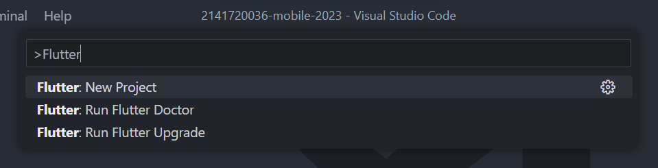

## Langkah 2:
Kemudian membuat folder sesuai style laporan praktikum yang dipilih. Lalu pilih Select a folder to create the project in.

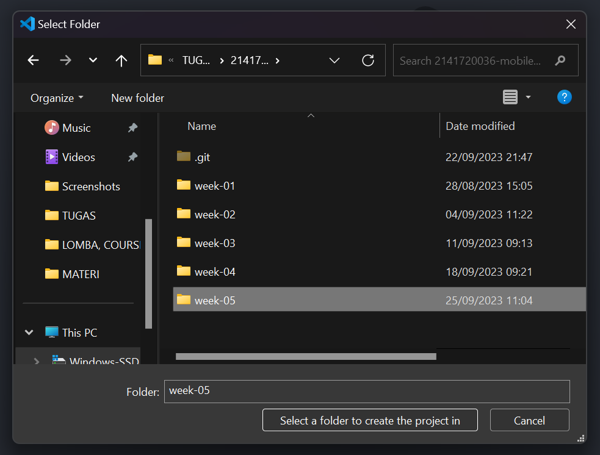

## Langkah 3:
Membuat nama project flutter hello_world seperti berikut, lalu tekan Enter. Tunggu hingga proses pembuatan project baru selesai.

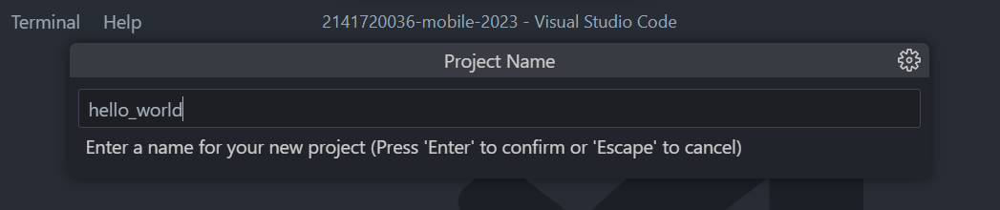

## Langkah 4:
Jika sudah selesai proses pembuatan project baru, maka tampilannya seperti berikut. Pesan akan tampil berupa "Your Flutter Project is ready!" artinya telah berhasil membuat project Flutter baru.

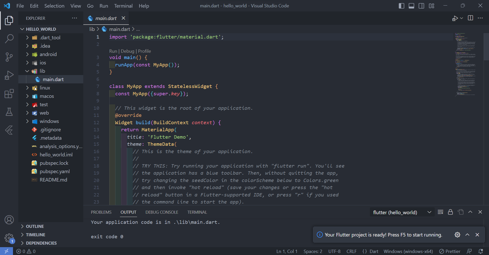

# Praktikum 2: Membuat Repository GitHub dan Laporan Praktikum

## Langkah 1-10:
Dikarenakan Project ini sudah saya letakkan pada repository Github, maka saya lanjtutkan ke langkah 11.

## Langkah 11:
Dikarenakan Project ini sudah saya letakkan pada repository Github, maka saya lanjutkan ke langkah 11.

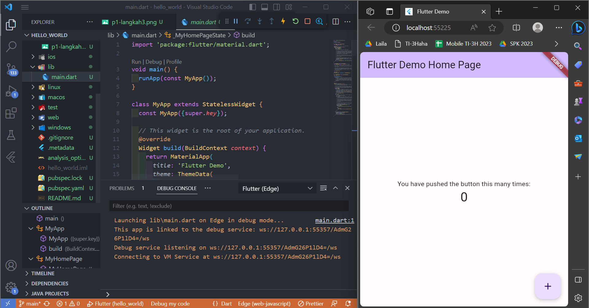

## Langkah 12:
Silakan screenshot seperti pada Langkah 11, namun teks yang ditampilkan dalam aplikasi berupa nama lengkap Anda. Simpan file screenshot dengan nama 01.png pada folder images (buat folder baru jika belum ada) di project hello_world Anda. Lalu ubah isi README.md seperti berikut, sehingga tampil hasil screenshot pada file README.md. Kemudian push ke repository Anda.

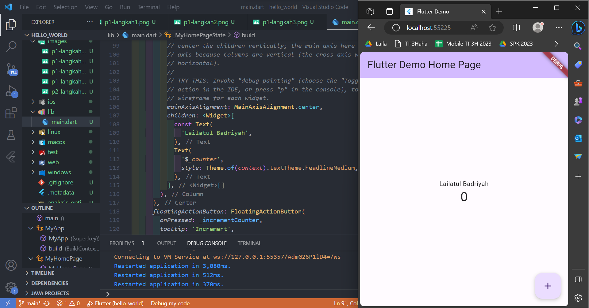

# Praktikum 3: Menerapkan Widget Dasar

## Langkah 1: Text Widget
Buat folder baru **basic_widgets** di dalam folder **lib**. Kemudian buat file baru di dalam basic_widgets dengan nama `text_widget.dart`. Ketik atau salin kode program berikut ke project hello_world Anda pada file `text_widget.dart`.

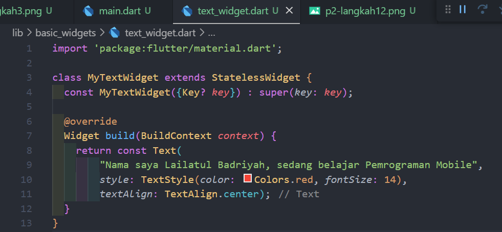

Lakukan import file `text_widget.dart` ke main.dart, lalu ganti bagian text widget dengan kode di atas. Maka hasilnya seperti gambar berikut. Screenshot hasil milik Anda, lalu dibuat laporan pada file README.md.

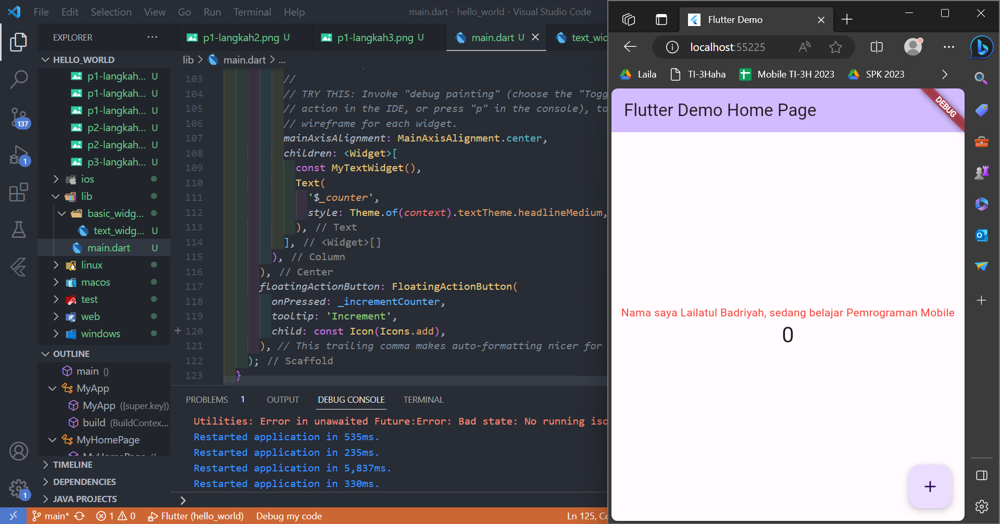

## Langkah 2: Image Widget
Buat sebuah file `image_widget`.dart di dalam folder basic_widgets dengan isi kode berikut.

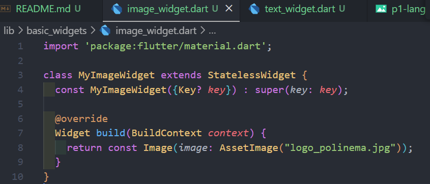

Lakukan penyesuaian asset pada file `pubspec.yaml` dan tambahkan file logo Anda di folder assets project hello_world.

Jangan lupa sesuaikan kode dan import di file `main.dart` kemudian akan tampil gambar seperti berikut.
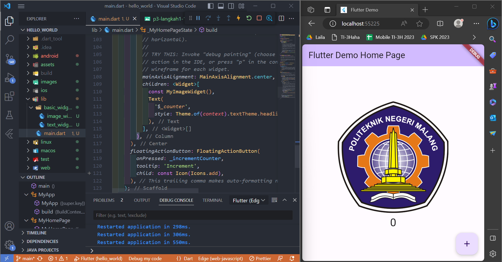

# Praktikum 4: Menerapkan Widget Material Design dan iOS Cupertino

## Langkah 1: Cupertino Button dan Loading Bar

Buat file di basic_widgets > `loading_cupertino.dart`. Import stateless widget dari material dan cupertino. Lalu isi kode di dalam method Widget build adalah sebagai berikut.

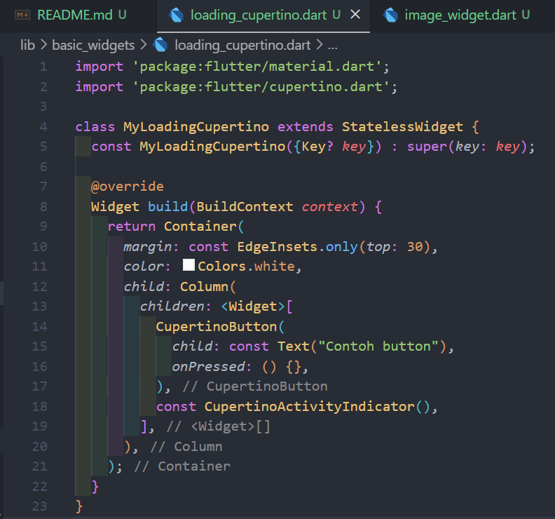

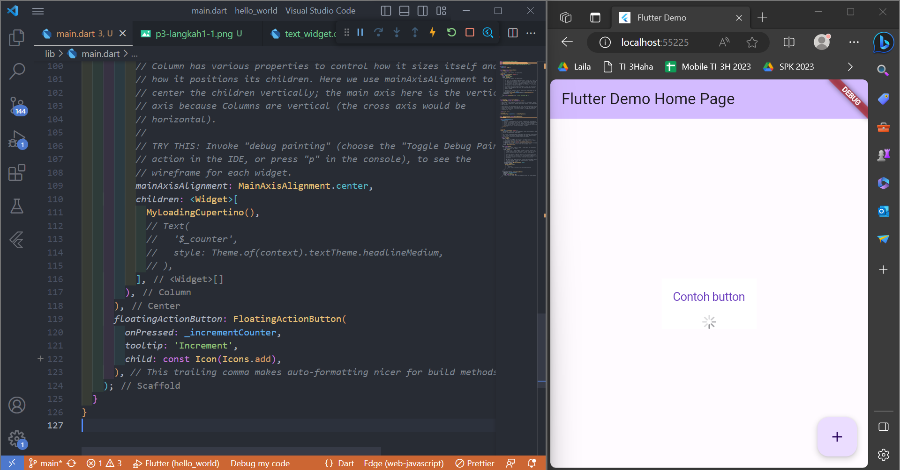

## Langkah 2: Floating Action Button (FAB)

Buat file di basic_widgets > `fab_widget.dart`. Import stateless widget dari material. Lalu isi kode di dalam method Widget build adalah sebagai berikut.

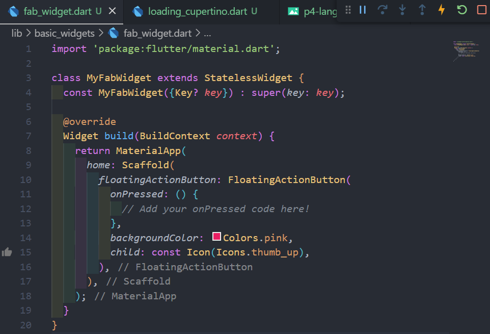

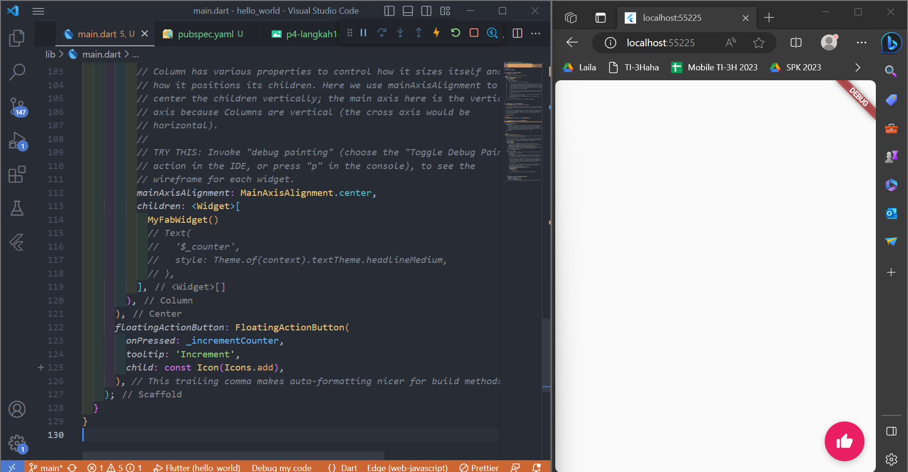

## Langkah 3: Scaffold Widget

Scaffold widget digunakan untuk mengatur tata letak sesuai dengan material design.
Ubah isi kode `main.dart` seperti berikut.

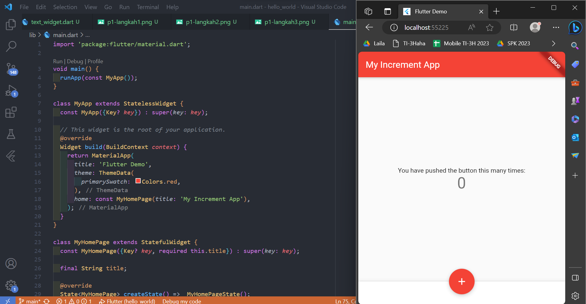

## Langkah 4: Dialog Widget

Dialog widget pada flutter memiliki dua jenis dialog yaitu `AlertDialog` dan `SimpleDialog`.
Ubah isi kode `main.dart` seperti berikut.

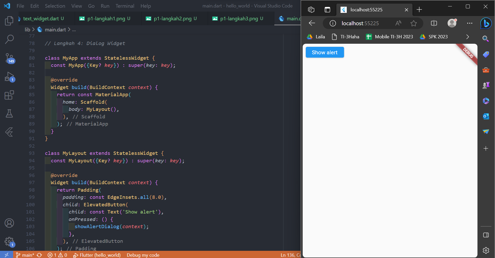

## Langkah 5: Input dan Selection Widget

Flutter menyediakan widget yang dapat menerima input dari pengguna aplikasi yaitu antara lain Checkbox, Date and Time Pickers, Radio Button, Slider, Switch, TextField.

Contoh penggunaan TextField widget adalah sebagai berikut:

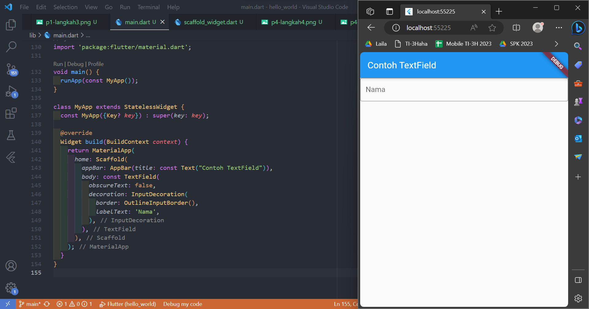

## Langkah 6: Date and Time Pickers

Date and Time Pickers termasuk pada kategori input dan selection widget, berikut adalah contoh penggunaan Date and Time Pickers.

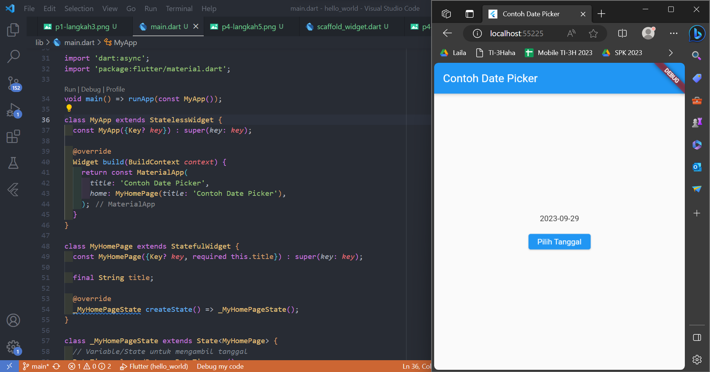

# Tugas Praktikum

1. Selesaikan Praktikum 1 sampai 4, lalu dokumentasikan dan push ke repository Anda berupa screenshot setiap hasil pekerjaan beserta penjelasannya di file `README.md`!

## Jawab:
Done

2. Pada praktikum 4 mulai dari Langkah 3 sampai 6, buatlah file widget tersendiri di folder `basic_widgets`, kemudian pada file main.dart cukup melakukan import widget sesuai masing-masing langkah tersebut!

## Jawab:
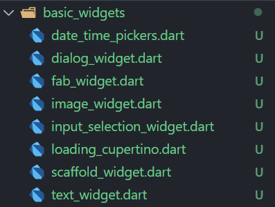

3. Selesaikan Codelabs: Your first Flutter app, lalu buatlah laporan praktikumnya dan push ke repository GitHub Anda!

## Jawab:
https://github.com/lailatulbadriyah24/namer_app_laila

4. `README.md` berisi: capture hasil akhir tiap praktikum (side-by-side, bisa juga berupa file GIF agar terlihat proses perubahan ketika ada aksi dari pengguna) di browser dan perangkat fisik (device) dengan menampilkan NIM dan Nama Anda sebagai ciri pekerjaan Anda. Jika mode developer di perangkat HP Anda belum aktif, silakan cari di internet cara mengaktifkannya!

## Jawab:
Done

5. Kumpulkan berupa link repository/commit GitHub Anda ke tautan spreadsheet yang telah disepakati oleh dosen!

## Jawab:
Done