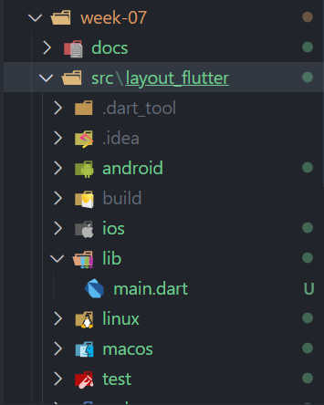
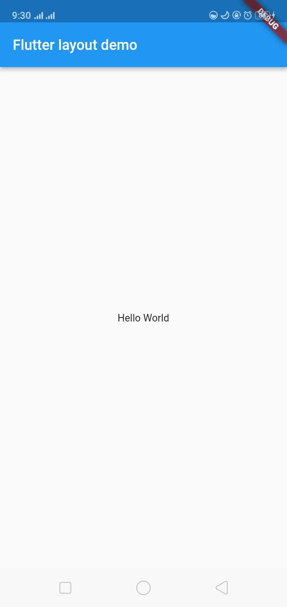
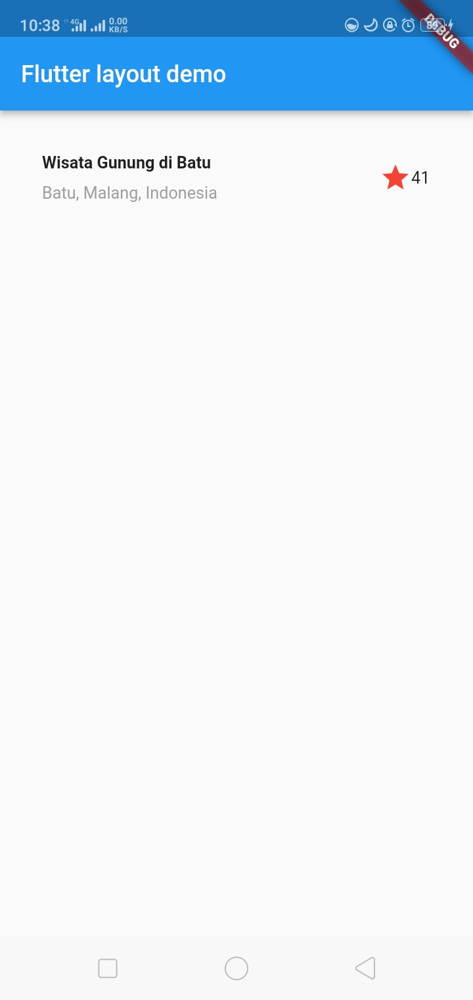
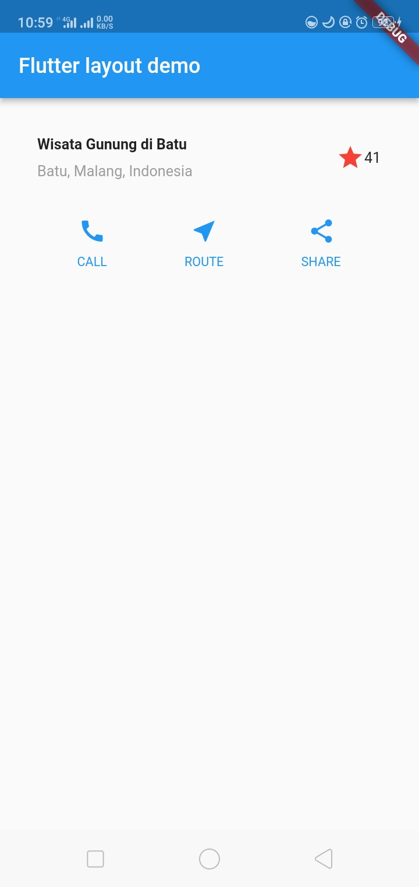
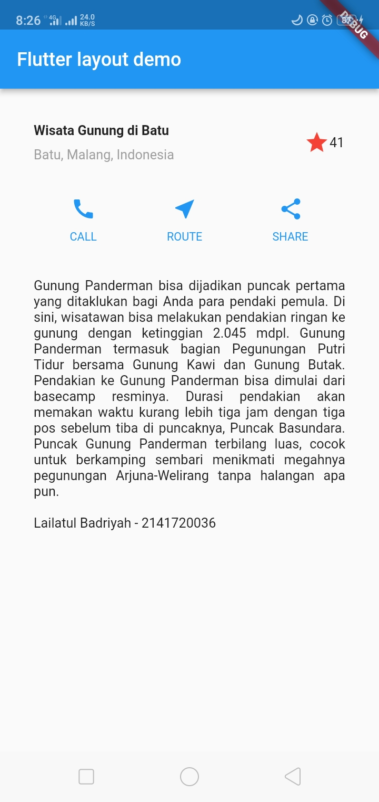
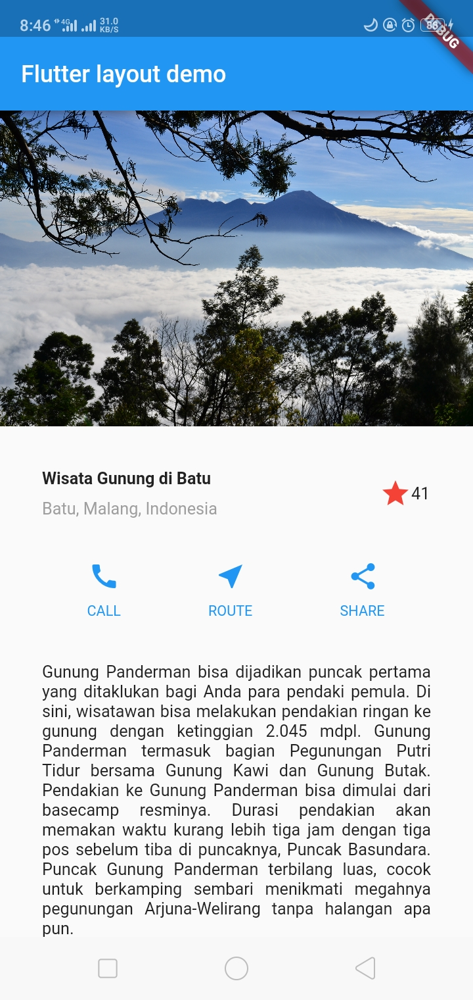

# Pemrograman Mobile

## Layout dan Navigasi

- **Nama:** Lailatul Badriyah
- **NIM:** 2141720036
- **Kelas:** TI-3H
- **No Absen:** 14

# **Praktikum**

## **Praktikum 1: Membangun Layout di Flutter**

### Langkah 1: Buat Project Baru
Buatlah sebuah project flutter baru dengan nama **layout_flutter**. Atau sesuaikan style laporan praktikum yang Anda buat.

### Jawaban:


### Langkah 2: Buka file lib/main.dart
Buka file `main.dart` lalu ganti dengan kode berikut. Isi nama dan NIM Anda di `text title`.
```javascript
import 'package:flutter/material.dart';

void main() => runApp(const MyApp());

class MyApp extends StatelessWidget {
  const MyApp({super.key});

  @override
  Widget build(BuildContext context) {
    return MaterialApp(
      title: 'Flutter layout: Nama dan NIM Anda',
      home: Scaffold(
        appBar: AppBar(
          title: const Text('Flutter layout demo'),
        ),
        body: const Center(
          child: Text('Hello World'),
        ),
      ),
    );
  }
}
```

### Jawaban:
### Hasil


###  Langkah 3: Identifikasi layout diagram
Langkah pertama adalah memecah tata letak menjadi elemen dasarnya:

- Identifikasi baris dan kolom.
- Apakah tata letaknya menyertakan kisi-kisi (grid)?
- Apakah ada elemen yang tumpang tindih?
- Apakah UI memerlukan tab?
- Perhatikan area yang memerlukan alignment, padding, atau borders.

###  Langkah 4: Implementasi Title Row
Pertama, membuat kolom bagian kiri pada judul dengan menambahkan kode berikut di bagian atas metode build() di dalam kelas `MyApp`:
```Javascript
Widget titleSection = Container(
  padding: const EdgeInsets.all(...),
  child: Row(
    children: [
      Expanded(
        /* soal 1*/
        child: Column(
          crossAxisAlignment: ...,
          children: [
            /* soal 2*/
            Container(
              padding: const EdgeInsets.only(bottom: ...),
              child: const Text(
                'Wisata Gunung di Batu',
                style: TextStyle(
                  fontWeight: FontWeight.bold,
                ),
              ),
            ),
            Text(
              'Batu, Malang, Indonesia',
              style: TextStyle(...),
            ),
          ],
        ),
      ),
      /* soal 3*/
      Icon(
       ...,
        color: ...,
      ),
      const Text(...),
    ],
  ),
);
```

**Soal 1** Letakkan widget `Column` di dalam widget `Expanded` agar menyesuaikan ruang yang tersisa di dalam widget `Row`. Tambahkan properti `crossAxisAlignment` ke `CrossAxisAlignment.start` sehingga posisi kolom berada di awal baris.

**Soal 2** Letakkan baris pertama teks di dalam `Container` sehingga memungkinkan Anda untuk menambahkan padding = 8. Teks `‘Batu, Malang, Indonesia'` di dalam `Column`, set warna menjadi abu-abu.

**Soal 3** Dua item terakhir di baris judul adalah ikon bintang, set dengan warna merah, dan teks "41". Seluruh baris ada di dalam `Container` dan beri padding di sepanjang setiap tepinya sebesar 32 piksel. Kemudian ganti isi `body text ‘Hello World'` dengan variabel `titleSection` seperti berikut:

### Jawaban:
### **Kode Lengkap**
```Javascript
import 'package:flutter/material.dart';

void main() => runApp(const MyApp());

class MyApp extends StatelessWidget {
  const MyApp({super.key});

  @override
  Widget build(BuildContext context) {
    Widget titleSection = Container(
      padding: const EdgeInsets.all(32),
      child: Row(
        children: [
          Expanded(
            /* soal 1*/
            child: Column(
              crossAxisAlignment: CrossAxisAlignment.start,
              children: [
                /* soal 2*/
                Container(
                  padding: const EdgeInsets.only(bottom: 8),
                  child: const Text(
                    'Wisata Gunung di Batu',
                    style: TextStyle(
                      fontWeight: FontWeight.bold,
                    ),
                  ),
                ),
                Text(
                  'Batu, Malang, Indonesia',
                  style: TextStyle(
                    color: Colors.grey[500],
                  ),
                ),
              ],
            ),
          ),
          /* soal 3*/
          Icon(
            Icons.star,
            color: Colors.red[500],
          ),
          const Text('41'),
        ],
      ),
    );

    return MaterialApp(
      title: 'Flutter layout: Lailatul Badriyah - 2141720036',
      home: Scaffold(
        appBar: AppBar(
          title: const Text('Flutter layout demo'),
        ),
        body: Column(
          children: [
            titleSection,
          ],
        ),
      ),
    );
  }
 }

```
### Hasil


## **Praktikum 2: Implementasi Button Row**

###  Langkah 1: Buat method Column _buildButtonColumn

Bagian tombol berisi 3 kolom yang menggunakan tata letak yang sama—sebuah ikon di atas baris teks. Kolom pada baris ini diberi jarak yang sama, dan teks serta ikon diberi warna primer.

Karena kode untuk membangun setiap kolom hampir sama, buatlah metode pembantu pribadi bernama `buildButtonColumn()`, yang mempunyai parameter warna, `Icon` dan `Text`, sehingga dapat mengembalikan kolom dengan widgetnya sesuai dengan warna tertentu.

```Javascript
class MyApp extends StatelessWidget {
  const MyApp({super.key});

  @override
  Widget build(BuildContext context) {
    // ···
  }

  Column _buildButtonColumn(Color color, IconData icon, String label) {
    return Column(
      mainAxisSize: MainAxisSize.min,
      mainAxisAlignment: MainAxisAlignment.center,
      children: [
        Icon(icon, color: color),
        Container(
          margin: const EdgeInsets.only(top: 8),
          child: Text(
            label,
            style: TextStyle(
              fontSize: 12,
              fontWeight: FontWeight.w400,
              color: color,
            ),
          ),
        ),
      ],
    );
  }
}
```
### Jawaban:

```Javascript
import 'package:flutter/material.dart';

void main() => runApp(const MyApp());

class MyApp extends StatelessWidget {
  const MyApp({super.key});

  @override
  Widget build(BuildContext context) {
    Widget titleSection = Container(
      padding: const EdgeInsets.all(32),
      child: Row(
        children: [
          Expanded(
            /* soal 1*/
            child: Column(
              crossAxisAlignment: CrossAxisAlignment.start,
              children: [
                /* soal 2*/
                Container(
                  padding: const EdgeInsets.only(bottom: 8),
                  child: const Text(
                    'Wisata Gunung di Batu',
                    style: TextStyle(
                      fontWeight: FontWeight.bold,
                    ),
                  ),
                ),
                Text(
                  'Batu, Malang, Indonesia',
                  style: TextStyle(
                    color: Colors.grey[500],
                  ),
                ),
              ],
            ),
          ),
          /* soal 3*/
          Icon(
            Icons.star,
            color: Colors.red[500],
          ),
          const Text('41'),
        ],
      ),
    );

    return MaterialApp(
      title: 'Flutter layout: Lailatul Badriyah - 2141720036',
      home: Scaffold(
        appBar: AppBar(
          title: const Text('Flutter layout demo'),
        ),
        body: Column(
          children: [
            titleSection,
          ],
        ),
      ),
    );
  }

  /*Build Method Button Column*/
  Column _buildButtonColumn(Color color, IconData icon, String label) {
    return Column(
      mainAxisSize: MainAxisSize.min,
      mainAxisAlignment: MainAxisAlignment.center,
      children: [
        Icon(icon, color: color),
        Container(
          margin: const EdgeInsets.only(top: 8),
          child: Text(
            label,
            style: TextStyle(
              fontSize: 12,
              fontWeight: FontWeight.w400,
              color: color,
            ),
          ),
        ),
      ],
    );
  }
}
```

### Langkah 2: Buat widget buttonSection
Menambhkan Fungsi untuk menambahkan ikon langsung ke kolom. Teks berada di dalam `Container` dengan margin hanya di bagian atas, yang memisahkan teks dari ikon.

Membangun baris yang berisi kolom-kolom ini dengan memanggil fungsi dan set warna, `Icon`, dan teks khusus melalui parameter ke kolom tersebut. Sejajarkan kolom di sepanjang sumbu utama menggunakan `MainAxisAlignment.spaceEvenly` untuk mengatur ruang kosong secara merata sebelum, di antara, dan setelah setiap kolom. Menambahkan kode berikut tepat di bawah deklarasi `titleSection` di dalam metode `build()`:

```Javascript
Color color = Theme.of(context).primaryColor;

Widget buttonSection = Row(
  mainAxisAlignment: MainAxisAlignment.spaceEvenly,
  children: [
    _buildButtonColumn(color, Icons.call, 'CALL'),
    _buildButtonColumn(color, Icons.near_me, 'ROUTE'),
    _buildButtonColumn(color, Icons.share, 'SHARE'),
  ],
  ```

### Langkah 3: Tambah button section ke body
Menambahkan variabel buttonSection ke dalam `body` seperti berikut:
```Javascript         
      child: Text('Hello World'),            
      body: Column(            
      children: [            
      titleSection,
      /*Add Button Section*/
      buttonSection,            
      ],            
    ),            
```
### Hasil


## **Praktikum 3: Implementasi Text Section**

### Langkah 1: Buat widget textSection
Tentukan bagian teks sebagai variabel. Masukkan teks ke dalam `Container` dan tambahkan padding di sepanjang setiap tepinya. Tambahkan kode berikut tepat di bawah deklarasi `buttonSection`:
```Javascript
Widget textSection = Container(
  padding: const EdgeInsets.all(32),
  child: const Text(
    'Carilah teks di internet yang sesuai '
    'dengan foto atau tempat wisata yang ingin '
    'Anda tampilkan. '
    'Lailatul Badriyah - 2141720036',
    softWrap: true,
  ),
);
```
### Jawaban:
```Javascript
    Widget textSection = Container(
      padding: const EdgeInsets.all(32),
      child: const Text(
        'Gunung Panderman bisa dijadikan puncak pertama yang ditaklukan bagi Anda para pendaki pemula. Di sini, wisatawan bisa melakukan pendakian ringan ke gunung dengan ketinggian 2.045 mdpl. Gunung Panderman termasuk bagian Pegunungan Putri Tidur bersama Gunung Kawi dan Gunung Butak. Pendakian ke Gunung Panderman bisa dimulai dari basecamp resminya. Durasi pendakian akan memakan waktu kurang lebih tiga jam dengan tiga pos sebelum tiba di puncaknya, Puncak Basundara. Puncak Gunung Panderman terbilang luas, cocok untuk berkamping sembari menikmati megahnya pegunungan Arjuna-Welirang tanpa halangan apa pun.\n\n'
        'Lailatul Badriyah - 2141720036',
        softWrap: true,
        textAlign: TextAlign.justify,
      ),
    );
```

### Langkah 2: Tambahkan Variabel **Text Section** ke Body
Tambahkan widget variabel `textSection` ke dalam `body` seperti berikut:
```Javascript         
      child: Text('Hello World'),            
      body: Column(            
      children: [            
      titleSection,
      /*Add Button Section*/
      buttonSection,   
      /*Add Text Section*/
      textSection,         
      ],            
    ),            
```

### Hasil


## **Praktikum 3: Implementasi Image Section**

### Langkah 1: Siapkan Aset Gambar
Anda dapat mencari gambar di internet yang ingin ditampilkan. Buatlah folder `images` di root project **layout_flutter**. Masukkan file gambar tersebut ke folder `images`, lalu set nama file tersebut ke file `pubspec.yaml` seperti berikut:
```Javascript
  uses-material-design: true
  assets:
    - assets/gunung_panderman.jpg
```
### Langkah 2: Tambahkan gambar ke body
```Javascript
        body: Column(
          children: [
            /*Add Image Section*/
            Image.asset('assets/gunung_panderman.jpg',
            width: 600,
            height: 240,
            fit: BoxFit.cover,
            ),
            titleSection,
            /*Add Button Section*/
            buttonSection,
            /*Add Text Section*/
            textSection,
          ],
        ),
```

### Langkah 3: Ubah Menjadi ListView
```Javascript
        body: ListView( /*Change to ListView*/
          children: [
            /*Add Image Section*/
            Image.asset('assets/gunung_panderman.jpg',
            width: 600,
            height: 240,
            fit: BoxFit.cover,
            ),
            titleSection,
            /*Add Button Section*/
            buttonSection,
            /*Add Text Section*/
            textSection,
          ],
        ),
```
### Hasil


# **Tugas Praktikum**

1. Selesaikan Praktikum 1 sampai 4, lalu dokumentasikan dan push ke repository Anda berupa screenshot setiap hasil pekerjaan beserta penjelasannya di file `README.md`!
### Jawaban: 
Done

2. Silakan implementasikan di project baru **"basic_layout_flutter"** dengan mengakses sumber ini: https://docs.flutter.dev/codelabs/layout-basics
### Jawaban:
[Basic Layout Flutter - Lailatul Badriyah](https://github.com/lailatulbadriyah24/2141720036-mobile-2023/blob/main/week-07/src/basic_layout_flutter/README.md).

3. Kumpulkan link commit repository GitHub Anda ke spreadsheet yang telah disediakan!
### Jawaban: 
Done