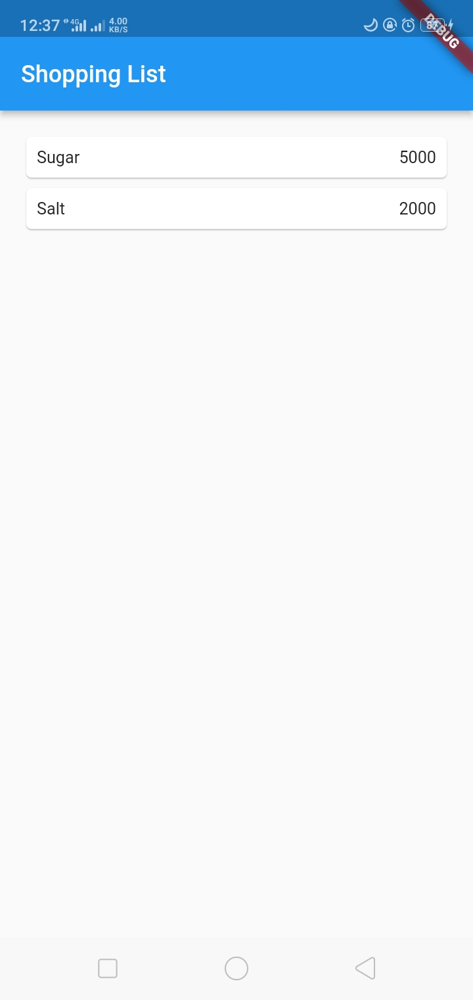
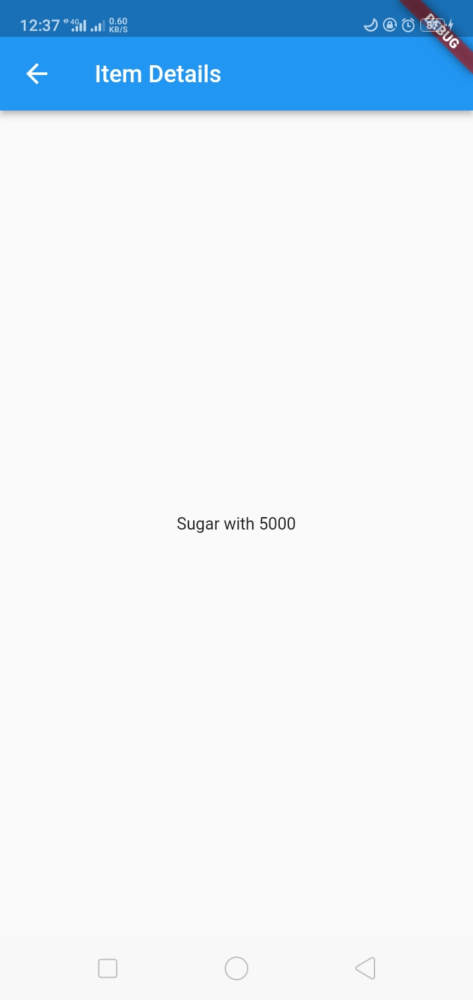
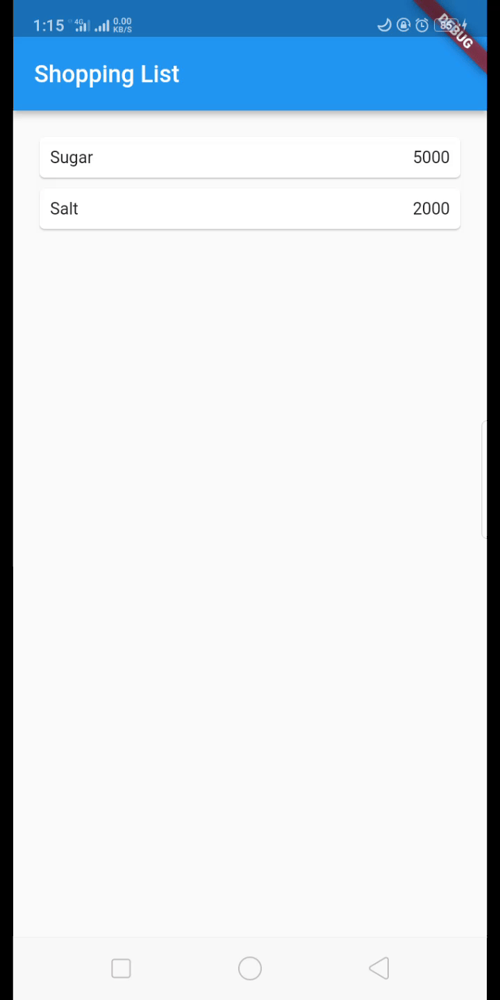
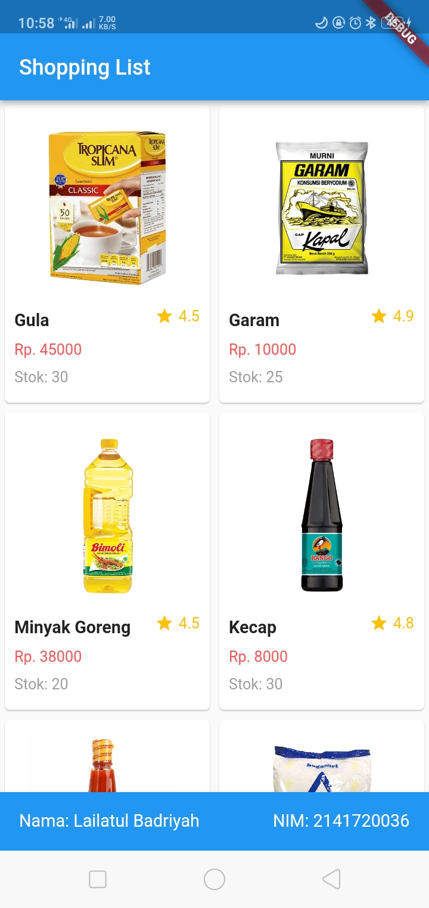
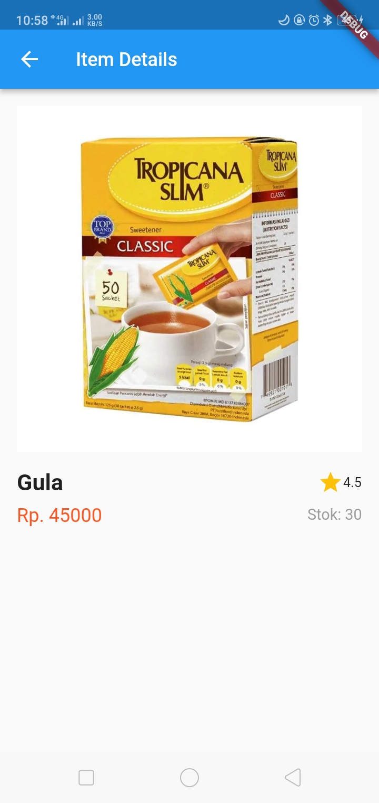

# Pemrograman Mobile

## Layout dan Navigasi

- **Nama:** Lailatul Badriyah
- **NIM:** 2141720036
- **Kelas:** TI-3H
- **No Absen:** 14

# **Praktikum**

## **Praktikum 5: Membangun Navigasi di Flutter**
### Jawab:
`main.dart`
```Javascript
import 'package:belanja/pages/home_page.dart';
import 'package:belanja/pages/item_page.dart';
import 'package:flutter/material.dart';

void main() {
  runApp(MaterialApp(
    initialRoute: '/',
    routes: {
      '/': (context) => HomePage(),
      '/item': (context) => ItemPage(),
    },
  ));
}
```

`home_page.dart`
```Javascript
import 'package:belanja/models/item.dart';
import 'package:flutter/material.dart';

class HomePage extends StatelessWidget {
  final List<Item> items = [
    Item(name: 'Sugar', price: 5000),
    Item(name: 'Salt', price: 2000),
  ];

  @override
  Widget build(BuildContext context) {
    return Scaffold(
      appBar: AppBar(
        title: const Text('Shopping List'),
      ),
      body: Container(
        margin: const EdgeInsets.all(15),
        child: ListView.builder(
          itemCount: items.length,
          itemBuilder: (context, index) {
            final item = items[index];
            return Material(
              child: InkWell(
                onTap: () {
                  Navigator.pushNamed(context, '/item', arguments: item);
                },
                child: Card(
                  child: Container(
                    margin: const EdgeInsets.all(8),
                    child: Row(
                      children: [
                        Expanded(child: Text(item.name.toString())),
                        Expanded(
                          child: Text(
                            item.price.toString(),
                            textAlign: TextAlign.end,
                          ),
                        )
                      ],
                    ),
                  ),
                ),
              ),
            );
          },
        ),
      ),
    );
  }
}
```

`item_page.dart`
```Javascript
import 'package:belanja/models/item.dart';
import 'package:flutter/material.dart';

class ItemPage extends StatelessWidget {
  @override
  Widget build(BuildContext context) {
    final item = ModalRoute.of(context)!.settings.arguments as Item;

    return Scaffold(
      appBar: AppBar(
        title: Text('Item Details'),
      ),
      body: Center(
        child: Column(
          mainAxisAlignment: MainAxisAlignment.center,
          children: [Text('${item.name} with ${item.price}')],
        ),
      ),
    );
  }
}
```

`item.dart`
```Javascript
class Item {
  String name;
  int price;

  Item({
    required this.name,
    required this.price,
  });
}
```

### Hasil Screenshot



### Hasil GIF


# **Tugas**
1. Untuk melakukan pengiriman data ke halaman berikutnya, cukup menambahkan informasi arguments pada penggunaan `Navigator`. Perbarui kode pada bagian `Navigator` menjadi seperti berikut.
```Javascript
Navigator.pushNamed(context, '/item', arguments: item);
```

2. Pembacaan nilai yang dikirimkan pada halaman sebelumnya dapat dilakukan menggunakan `ModalRoute`. Tambahkan kode berikut pada blok fungsi build dalam halaman `ItemPage`. Setelah nilai didapatkan, anda dapat menggunakannya seperti penggunaan variabel pada umumnya. 
(https://docs.flutter.dev/cookbook/navigation/navigate-with-arguments)
```Javascript
final itemArgs = ModalRoute.of(context)!.settings.arguments as Item;
```

3. Pada hasil akhir dari aplikasi **belanja** yang telah anda selesaikan, tambahkan atribut foto produk, stok, dan rating. Ubahlah tampilan menjadi `GridView` seperti di aplikasi marketplace pada umumnya.

4. Silakan implementasikan `Hero Widget` pada aplikasi **belanja** Anda dengan mempelajari dari sumber ini: https://docs.flutter.dev/cookbook/navigation/hero-animations

5. Sesuaikan dan modifikasi tampilan sehingga menjadi aplikasi yang menarik. Selain itu, pecah widget menjadi kode yang lebih kecil. Tambahkan **Nama** dan **NIM** di footer aplikasi **belanja** Anda.

6. Selesaikan Praktikum Navigasi dan Rute tersebut, lalu dokumentasikan dan push ke repository Anda berupa screenshot setiap hasil pekerjaan beserta penjelasannya di file `README.md`. Kumpulkan link commit repository GitHub Anda ke spreadsheet yang telah disediakan!

### Jawab:

`main.dart`
```Javascript
import 'package:belanja/pages/home_page.dart';
import 'package:belanja/pages/item_page.dart';
import 'package:flutter/material.dart';

void main() {
  runApp(MaterialApp(
    initialRoute: '/',
    routes: {
      '/': (context) => HomePage(),
      '/item': (context) => const ItemPage(),
    },
  ));
}
```

`home_page.dart`
```Javascript
import 'package:belanja/models/item.dart';
import 'package:flutter/material.dart';

class HomePage extends StatelessWidget {
  final List<Item> items = [
    Item(
        name: 'Gula',
        price: 45000,
        imgUrl: 'assets/gula.jpg',
        stok: 30,
        rating: 4.5),
    Item(
        name: 'Garam',
        price: 10000,
        imgUrl: 'assets/garam.jpeg',
        stok: 25,
        rating: 4.9),
    Item(
        name: 'Minyak Goreng',
        price: 38000,
        imgUrl: 'assets/minyak.jpg',
        stok: 20,
        rating: 4.5),
    Item(
        name: 'Kecap',
        price: 8000,
        imgUrl: 'assets/kecap.jpeg',
        stok: 30,
        rating: 4.8),
    Item(
        name: 'Saos Sambal',
        price: 7000,
        imgUrl: 'assets/saos_sambal.jpeg',
        stok: 35,
        rating: 4.9),
    Item(
        name: 'Tepung Terigu',
        price: 2000,
        imgUrl: 'assets/tepung-terigu.jpg',
        stok: 50,
        rating: 4.7),
    Item(
        name: 'Kopi Bubuk',
        price: 6000,
        imgUrl: 'assets/kopi-hitam.jpg',
        stok: 40,
        rating: 4.4),
    Item(
        name: 'Indomie',
        price: 3000,
        imgUrl: 'assets/indomie.jpg',
        stok: 100,
        rating: 4.9),
  ];

  @override
  Widget build(BuildContext context) {
    return Scaffold(
      appBar: AppBar(
        title: const Text('Shopping List'),
      ),
      body: GridView.builder(
        gridDelegate: const SliverGridDelegateWithFixedCrossAxisCount(
          crossAxisCount: 2, // Menampilkan 2 item per baris
          childAspectRatio: 0.7, // Mengatur rasio lebar-tinggi item
        ),
        itemCount: items.length,
        itemBuilder: (context, index) {
          final item = items[index];
          return InkWell(
            onTap: () {
              Navigator.pushNamed(context, '/item', arguments: item);
            },
            child: Card(
              child: Padding(
                padding: const EdgeInsets.all(
                    8), // Tambahkan padding pada keseluruhan Card
                child: Column(
                  crossAxisAlignment: CrossAxisAlignment.start,
                  children: [
                    Hero(
                      tag: 'productImage${item.name}',
                      child: AspectRatio(
                        aspectRatio:
                            1, // Rasio lebar-tinggi 1:1 untuk ukuran yang sama
                        child: Image.asset(item.imgUrl, fit: BoxFit.cover),
                      ),
                    ),
                    Row(
                      mainAxisAlignment: MainAxisAlignment
                          .spaceBetween, // Agar rating berada di sebelah kanan
                      children: [
                        Padding(
                          padding: const EdgeInsets.only(
                              top: 8), // Padding di atas teks "name"
                          child: Text(
                            item.name,
                            style: const TextStyle(
                              fontWeight: FontWeight.bold,
                              fontSize: 16,
                            ),
                          ),
                        ),
                        Row(
                          children: [
                            Icon(Icons.star, color: Colors.amber, size: 16),
                            SizedBox(
                                width:
                                    4), // Tambahkan jarak horizontal sebesar 4
                            Text(
                              item.rating.toString(),
                              style: const TextStyle(
                                color: Colors.amber,
                                fontSize: 14,
                              ),
                            ),
                          ],
                        ),
                      ],
                    ),
                    Padding(
                      padding: const EdgeInsets.symmetric(vertical: 8),
                      child: Text(
                        'Rp. ${item.price}',
                        style: const TextStyle(
                          color: Colors.redAccent,
                          fontSize: 14,
                        ),
                      ),
                    ),
                    Text(
                      'Stok: ${item.stok}',
                      style: const TextStyle(
                        color: Colors.grey,
                        fontSize: 14,
                      ),
                    ),
                  ],
                ),
              ),
            ),
          );
        },
      ),
      bottomNavigationBar: BottomAppBar(
        child: Container(
          padding: const EdgeInsets.all(16),
          decoration: const BoxDecoration(
            color: Colors.blue,
          ),
          child: const Row(
            mainAxisAlignment: MainAxisAlignment.spaceBetween,
            children: [
              Text(
                'Nama: Lailatul Badriyah',
                style: TextStyle(
                  color: Colors.white,
                  fontSize: 16,
                ),
              ),
              Text(
                'NIM: 2141720036',
                style: TextStyle(
                  color: Colors.white,
                  fontSize: 16,
                ),
              ),
            ],
          ),
        ),
      ),
    );
  }
}
```

`item_page.dart`
```Javascript
import 'package:belanja/models/item.dart';
import 'package:flutter/material.dart';

class ItemPage extends StatelessWidget {
  const ItemPage({super.key});

  @override
  Widget build(BuildContext context) {
    final item = ModalRoute.of(context)!.settings.arguments as Item;

    return Scaffold(
      appBar: AppBar(
        title: const Text('Item Details'),
      ),
      body: Padding(
        padding: const EdgeInsets.all(16.0),
        child: Column(
          crossAxisAlignment: CrossAxisAlignment.start,
          children: [
            Hero(
              tag: 'productImage${item.name}',
              child: Image.asset(item.imgUrl, fit: BoxFit.cover),
            ),
            const SizedBox(height: 16),
            Row(
              children: [
                Expanded(
                  child: Column(
                    crossAxisAlignment: CrossAxisAlignment.start,
                    children: [
                      Row(
                        children: [
                          Text(
                            item.name,
                            style: const TextStyle(
                              fontSize: 24,
                              fontWeight: FontWeight.bold,
                            ),
                          ),
                          const Spacer(), // Ini akan membuat rating sejajar dengan nama
                          Row(
                            children: [
                              const Icon(Icons.star,
                                  color: Colors.amber, size: 20),
                              const SizedBox(width: 4),
                              Text(
                                item.rating.toString(),
                                style: const TextStyle(
                                  color: Colors.amber,
                                  fontSize: 18,
                                ),
                              ),
                            ],
                          ),
                        ],
                      ),
                      const SizedBox(height: 8),
                      Row(
                        children: [
                          Text(
                            'Rp. ${item.price}',
                            style: const TextStyle(
                              fontSize: 18,
                              color: Colors.redAccent,
                            ),
                          ),
                          const Spacer(), // Ini akan membuat rating dan stok sejajar di bagian bawah kanan
                          Text(
                            'Stok: ${item.stok}',
                            style: const TextStyle(
                              fontSize: 16,
                              color: Colors.grey,
                            ),
                          ),
                        ],
                      ),
                    ],
                  ),
                ),
              ],
            ),
          ],
        ),
      ),
      bottomNavigationBar: BottomAppBar(
        child: Container(
          padding: const EdgeInsets.all(16),
          decoration: const BoxDecoration(
            color: Colors.blue,
          ),
          child: const Row(
            mainAxisAlignment: MainAxisAlignment.spaceBetween,
            children: [
              Text(
                'Nama: Lailatul Badriyah',
                style: TextStyle(
                  color: Colors.white,
                  fontSize: 16,
                ),
              ),
              Text(
                'NIM: 2141720036',
                style: TextStyle(
                  color: Colors.white,
                  fontSize: 16,
                ),
              ),
            ],
          ),
        ),
      ),
    );
  }
}
```

`item.dart`
```Javascript
class Item {
  String name, imgUrl;
  int price, stok;
  double rating;

  Item(
      {required this.name,
      required this.price,
      required this.imgUrl,
      required this.stok,
      required this.rating});
}
```

### Hasil Screenshot



### Hasil GIF
