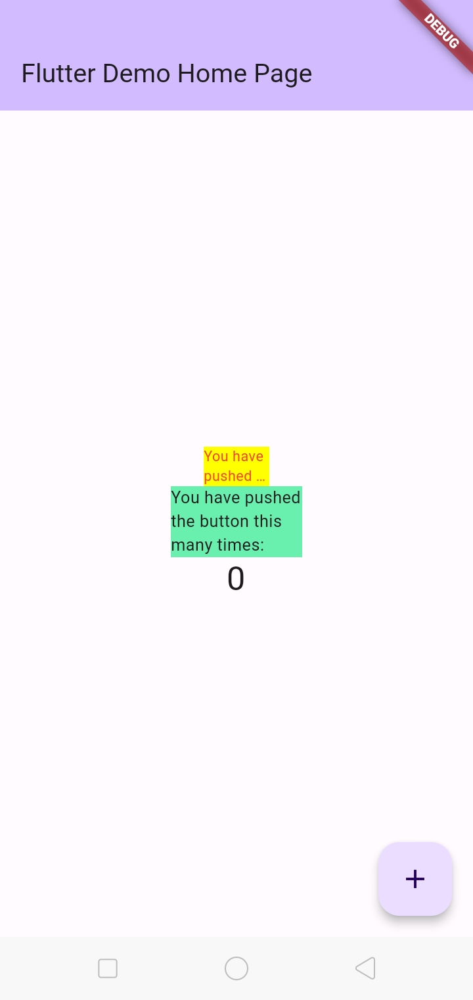

# Pemrograman Mobile

## Manajemen Plugin

- **Nama:** Lailatul Badriyah
- **NIM:** 2141720036
- **Kelas:** TI-3H
- **No Absen:** 14

# **Praktikum**

## **Praktikum Menerapkan Plugin di Project Flutter**

`red_text_widget.dart`

```Javascript
import 'package:auto_size_text/auto_size_text.dart';
import 'package:flutter/material.dart';

class RedTextWidget extends StatelessWidget {
  final String text;
  const RedTextWidget({Key? key, required this.text}) : super(key: key);

  @override
  Widget build(BuildContext context) {
    return AutoSizeText(
      text,
      style: const TextStyle(color: Colors.red, fontSize: 14),
      maxLines: 2,
      overflow: TextOverflow.ellipsis,
    );
  }
}
```

`main.dart`

```Javascript
      body: Center(
        child: Column(
          mainAxisAlignment: MainAxisAlignment.center,
          children: <Widget>[
            Container(
              color: Colors.yellowAccent,
              width: 50,
              child: const RedTextWidget(
                text: 'You have pushed the button this many times:',
              ),
            ),
            Container(
              color: Colors.greenAccent,
              width: 100,
              child: const Text(
                'You have pushed the button this many times:',
              ),
            ),
            Text(
              '$_counter',
              style: Theme.of(context).textTheme.headlineMedium,
            ),
          ],
        ),
      ),
```

### **Hasil**



# **Tugas Praktikum**

1. Selesaikan Praktikum tersebut, lalu dokumentasikan dan push ke repository Anda berupa screenshot hasil pekerjaan beserta penjelasannya di file `README.md`!

### Jawab:
Done

2. Jelaskan maksud dari langkah 2 pada praktikum tersebut!

### Jawab:
Langkah 2 dalam praktikum adalah menjalankan perintah `flutter pub add auto_size_text`, yang bertujuan untuk menambahkan package `auto_size_text` ke proyek Flutter. Package ini digunakan untuk mengatur ukuran teks secara otomatis agar sesuai dengan ruang yang tersedia di dalam widget dan membantu dalam menampilkan teks dengan lebih efisien dan rapi dalam proyek yang sedang dikerjakan.

3. Jelaskan maksud dari langkah 5 pada praktikum tersebut!

### Jawab:
Pada potongan kode yang diberikan:

`final String text;` adalah deklarasi variabel bernama `text` yang akan digunakan dalam widget ini dan akan menerima teks yang hendak ditampilkan di dalamnya.

`const RedTextWidget({Key? key, required this.text}) : super(key: key);` adalah konstruktor dari widget `RedTextWidget`. Ini mengambil parameter `text` yang wajib diisi dan digunakan untuk menginisialisasi variabel `text` di dalam widget. Sementara itu, parameter opsional `key` digunakan untuk mengidentifikasi widget secara unik, namun tidak wajib diisi.

Dengan kata lain, langkah 5 dalam praktikum ini adalah bagian dari pembuatan widget `RedTextWidget` yang memungkinkan pengiriman teks sebagai input dan kemudian menampilkan teks tersebut dengan warna merah dalam aplikasi Flutter. Widget ini berguna untuk mengatur tampilan teks dengan warna yang spesifik dalam aplikasi.

4. Pada langkah 6 terdapat dua widget yang ditambahkan, jelaskan fungsi dan perbedaannya!

### Jawab:

`Container dengan RedTextWidget`

- Container ini memiliki warna latar belakang kuning (yellowAccent) dan lebarnya diatur menjadi 50.
- Di dalamnya terdapat widget `RedTextWidget`, yang menampilkan teks "You have pushed the button this many times:" dengan warna merah.
- Widget ini menggunakan `auto_size_text` untuk mengatur ukuran teks secara otomatis sesuai dengan ruang yang tersedia dalam kontainer.

`Container dengan Text`

- Container ini memiliki warna latar belakang hijau (greenAccent) dan lebarnya diatur menjadi 100.
- Di dalamnya terdapat widget `Text`, yang juga menampilkan teks "You have pushed the button this many times:".
- Berbeda dengan widget pertama, widget ini tidak menggunakan `auto_size_text` sehingga ukuran teksnya tetap.

Perbedaannya terletak pada penggunaan plugin `auto_size_text`. Widget pertama `RedTextWidget` mengatur ukuran teks secara otomatis, sementara widget kedua dengan `Text` menampilkan teks dengan ukuran tetap. Widget pertama akan menyesuaikan ukuran teksnya jika teks tersebut terlalu panjang, sementara widget kedua tidak melakukan penyesuaian ukuran otomatis.

5. Jelaskan maksud dari tiap parameter yang ada di dalam plugin `auto_size_text` berdasarkan tautan pada dokumentasi [ini](https://pub.dev/documentation/auto_size_text/latest/) !

### Jawab:

- `key` : mengontrol bagaimana widget ini dapat menggantikan widget lain dalam pohon (tree) widget Flutter.
- `textKey` : menentukan kunci (key) yang digunakan untuk widget `Text` yang dihasilkan.
- `style` : menentukan gaya (style) yang akan digunakan untuk teks tersebut, seperti warna dan ukuran teks jika tidak null.
- `minFontSize` : menentukan ukuran minimum teks yang diizinkan saat teks menyesuaikan ukuran secara otomatis. Namun, parameter ini diabaikan jika `presetFontSizes` diatur.
- `maxFontSize` : menentukan ukuran maksimum teks saat teks menyesuaikan ukuran secara otomatis. Sama seperti `minFontSize`, parameter ini diabaikan jika `presetFontSizes` diatur.
- `stepGranularity` : mengatur ukuran langkah ketika menyesuaikan ukuran teks, hal ini mempengaruhi sejauh mana teks dapat menyesuaikan ukuran dengan tepat.
- `presetFontSizes` : daftar ukuran font yang telah ditentukan sebelumnya yang dapat digunakan dalam penyesuaian ukuran teks dan harus diatur dalam urutan menurun (besar ke kecil).
- `group` : menyelaraskan ukuran beberapa widget `AutoSizeText` sehingga mereka akan memiliki ukuran font yang sama.
- `textAlign` : menentukan cara teks diatur secara horizontal, misalnya, apakah di tengah, di kiri, atau di kanan.
- `textDirection` : menentukan arah teks dalam widget AutoSizeText, seperti `TextAlign.start` dan `TextAlign.end` diinterpretasikan.
- `locale`: memilih font ketika karakter Unicode yang sama dapat ditampilkan berbeda tergantung pada lokasi geografis atau bahasa.
- `softWrap` : menentukan apakah teks harus dipisahkan di "soft line breaks."
- `wrapWords` : menentukan apakah kata-kata yang tidak muat dalam satu baris harus dibungkus atau tidak. Secara default, ini diatur sebagai `true` agar berperilaku seperti widget `Text`.
- `overflow` : menentukan bagaimana cara penanganan visual ketika teks melebihi batasnya.
- `overflowReplacement` : widget yang akan ditampilkan jika teks melebihi batas dan tidak muat dalam widget ini.
- `textScaleFactor` : mengontrol seberapa besar teksnya, yang juga memengaruhi `minFontSize`, `maxFontSize`, dan `presetFontSizes`.
- `maxLines` : jumlah maksimum baris teks yang diizinkan.
- `semanticsLabel` : label alternatif untuk tujuan aksesibilitas (semantics).

6. Kumpulkan laporan praktikum Anda berupa link repository GitHub ke spreadsheet yang telah disediakan!

### Jawab:
Done