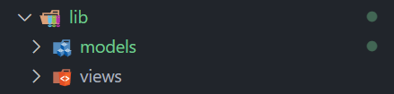
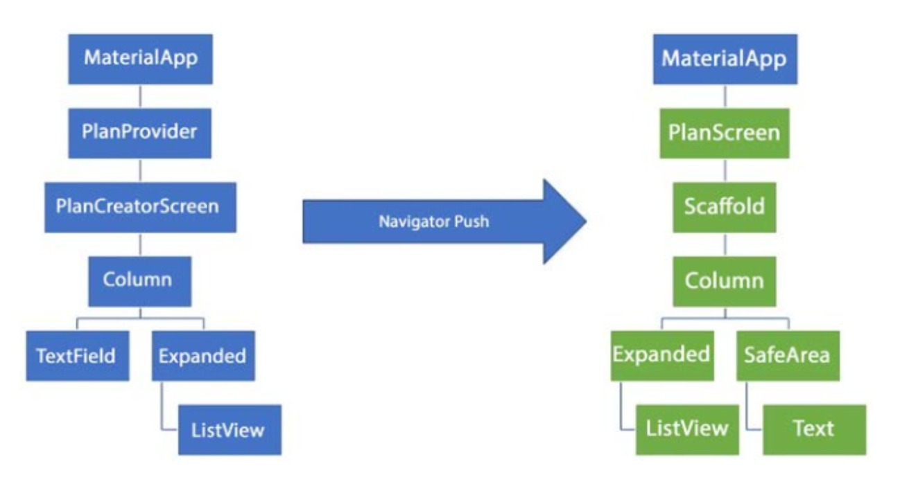
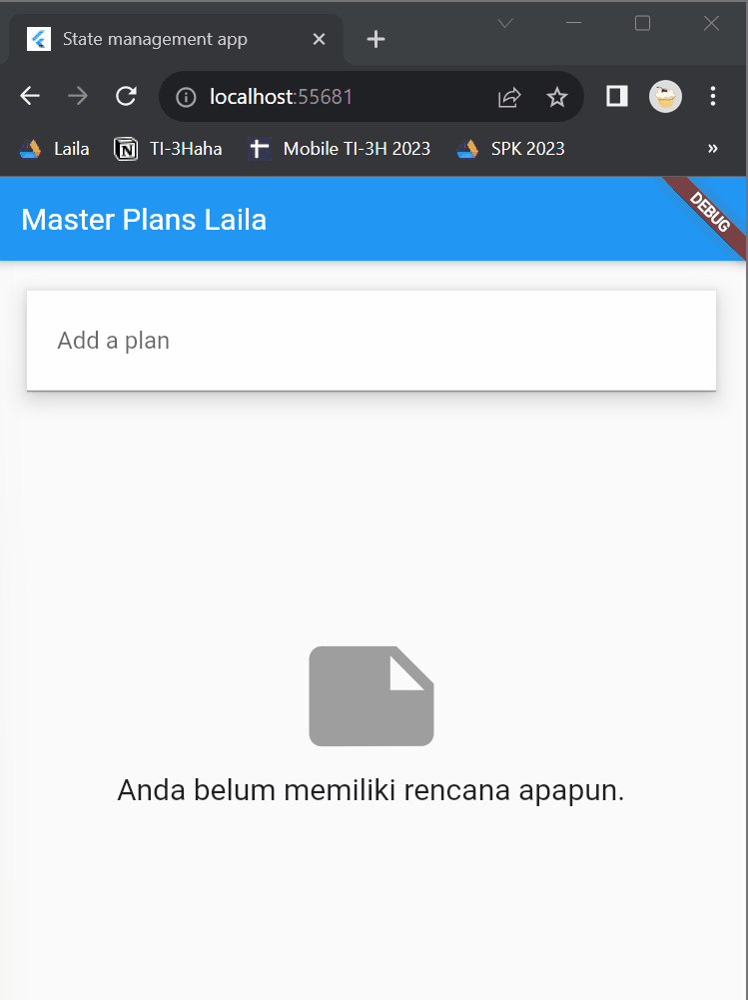

# Pemrograman Mobile

## Dasar State Management

- **Nama:** Lailatul Badriyah
- **NIM:** 2141720036
- **Kelas:** TI-3H
- **No Absen:** 14

# **Praktikum**

## **Praktikum 1: Dasar State dengan Model-View**

### Langkah 1: Buat Project Baru



### Langkah 2: Membuat model task.dart

`models/task.dart`

```Javascript
class Task {
  final String description;
  final bool complete;

  const Task({
    this.complete = false,
    this.description = '',
  });
}
```

### Langkah 3: Buat file plan.dart

`models/plan.dart`

```Javascript
import './task.dart';

class Plan {
  final String name;
  final List<Task> tasks;
  
  const Plan({this.name = '', this.tasks = const []});
}
```

### Langkah 4: Buat file data_layer.dart

`models/data_layer.dart`

```Javascript
export 'plan.dart';
export 'task.dart';
```

### Langkah 5: Pindah ke file main.dart

`main.dart`

```Javascript
import 'package:flutter/material.dart';
import './views/plan_screen.dart';

void main() => runApp(MasterPlanApp());

class MasterPlanApp extends StatelessWidget {
  const MasterPlanApp({super.key});

  @override
  Widget build(BuildContext context) {
    return MaterialApp(
      theme: ThemeData(primarySwatch: Colors.purple),
      home: PlanScreen(),
    );
  }
}
```

### Langkah 6-13: Buat plan_screen.dart

`views/plan_screen.dart`

```Javascript
import 'package:flutter/material.dart';
import '../models/data_layer.dart';

class PlanScreen extends StatefulWidget {
  const PlanScreen({super.key});

  @override
  State<PlanScreen> createState() => _PlanScreenState();
}

class _PlanScreenState extends State<PlanScreen> {
  Plan plan = const Plan();
  late ScrollController scrollController;

  @override
  void dispose() {
    scrollController.dispose();
    super.dispose();
  }

  @override
  void initState() {
    super.initState();
    scrollController = ScrollController()
      ..addListener(() {
        FocusScope.of(context).requestFocus(FocusNode());
      });
  }

  @override
  Widget build(BuildContext context) {
    return Scaffold(
      appBar: AppBar(
        title: const Text('Master Plan Laila'),
      ),
      body: _buildList(),
      floatingActionButton: _buildAddTextButton(),
    );
  }

  Widget _buildTextTile(Task task, int index) {
    return ListTile(
      leading: Checkbox(
          value: task.complete,
          onChanged: (selected) {
            setState(() {
              plan = Plan(
                name: plan.name,
                tasks: List<Task>.from(plan.tasks)
                  ..[index] = Task(
                    description: task.description,
                    complete: selected ?? false,
                  ),
              );
            });
          }),
      title: TextFormField(
        initialValue: task.description,
        onChanged: (text) {
          setState(() {
            plan = Plan(
              name: plan.name,
              tasks: List<Task>.from(plan.tasks)
                ..[index] = Task(
                  complete: task.complete,
                  description: text,
                ),
            );
          });
        },
      ),
    );
  }

  Widget _buildList() {
    return ListView.builder(
      controller: scrollController,
      itemCount: plan.tasks.length,
      itemBuilder: (context, index) => _buildTextTile(plan.tasks[index], index),
      keyboardDismissBehavior: Theme.of(context).platform == TargetPlatform.iOS
          ? ScrollViewKeyboardDismissBehavior.onDrag
          : ScrollViewKeyboardDismissBehavior.manual,
    );
  }

  Widget _buildAddTextButton() {
    return FloatingActionButton(
        child: const Icon(Icons.add),
        onPressed: () {
          setState(() {
            plan = Plan(
              name: plan.name,
              tasks: List<Task>.from(plan.tasks)..add(const Task()),
            );
          });
        });
  }
}
```

## **Tugas Praktikum 1: Dasar State dengan Model-View**

1. Selesaikan langkah-langkah praktikum tersebut, lalu dokumentasikan berupa GIF hasil akhir praktikum beserta penjelasannya di file `README.md`! Jika Anda menemukan ada yang error atau tidak berjalan dengan baik, silakan diperbaiki.

### Jawab

Done

2. Jelaskan maksud dari langkah 4 pada praktikum tersebut! Mengapa dilakukan demikian?

### Jawab

Langkah 4 pada praktikum ini dilakukan untuk menggabungkan dua model, yaitu plan.dart dan task.dart, dalam satu file yang diberi nama data_layer.dart di direktori models. File data_layer.dart ini kemudian mengekspor kedua model tersebut sehingga dapat diakses langsung oleh siapa pun yang mengimpor modul atau paket saat ini, tanpa perlu melakukan impor secara eksplisit.

3. Mengapa perlu variabel plan di langkah 6 pada praktikum tersebut? Mengapa dibuat konstanta?

### Jawab

Langkah 6 praktikum ini mencakup pembuatan variabel `plan` yang berfungsi sebagai wakil dari jenis data `Plan`. Penggunaan `const Plan()` memberikan nilai tetap yang digunakan sebagai nilai awal untuk variabel tersebut. Variabel `plan` sendiri diperlukan untuk menyimpan informasi terkait tugas atau rencana yang akan ditampilkan di layar. Konstanta digunakan di sini untuk memberikan nilai default yang konsisten saat variabel `plan` pertama kali dibuat.

4. Lakukan capture hasil dari Langkah 9 berupa GIF, kemudian jelaskan apa yang telah Anda buat!

### Jawab

Setelah menyelesaikan semua langkah pada Praktikum 1, berhasil membuat aplikasi daftar tugas (todo list) yang bernama "Master Plan Laila". Aplikasi ini dibangun dengan model data yang mencakup informasi mengenai task dan rencana plan. Pada tampilan utamanya, `PlanScreen`, digunakan `ListView.builder` untuk memperlihatkan daftar tugas. Pengguna juga dapat menambahkan tugas baru dengan mudah melalui button tambah dan mengisikan detail tugas. Masing-masing tugas dilengkapi dengan checkbox untuk menandai tugas sebagai 

### Hasil


5. Apa kegunaan method pada Langkah 11 dan 13 dalam lifecyle state ?

### Jawab

Langkah 11 menggunakan metode `initState()`, yang berperan saat pertama kali widget dibuat. Di langkah ini, `scrollController` dibuat untuk mengelola pengguliran (scroll), dan ketika pengguna melakukan pengguliran, fokus atau keyboard dihilangkan agar antarmuka terasa lebih rapi dan tanggap.

Langkah 13 menggunakan metode `dispose()`, yang dipanggil saat widget dihapus. Pada langkah ini, `scrollController` dibersihkan. Hal ini diperlukan untuk mencegah pemborosan memori dan untuk membebaskan sumber daya yang tidak lagi diperlukan setelah widget dihapus.

6. Kumpulkan laporan praktikum Anda berupa link commit atau repository GitHub ke spreadsheet yang telah disediakan!

### Jawab

Done

## **Praktikum 2: Mengelola Data Layer dengan InheritedWidget dan InheritedNotifier**

### Langkah 1: Buat file plan_provider.dart

`provider/plan_provider.dart`

```Javascript
import 'package:flutter/material.dart';
import '../models/data_layer.dart';

class PlanProvider extends InheritedNotifier<ValueNotifier<Plan>> {
  const PlanProvider({super.key, required Widget child, required
   ValueNotifier<Plan> notifier})
  : super(child: child, notifier: notifier);

  static ValueNotifier<Plan> of(BuildContext context) {
   return context.
    dependOnInheritedWidgetOfExactType<PlanProvider>()!.notifier!;
  }
}
```

### Langkah 2: Edit main.dart

`main.dart`

```Javascript
import 'package:flutter/material.dart';
import 'package:master_plan/models/plan.dart';
import 'package:master_plan/provider/plan_provider.dart';
import './views/plan_screen.dart';

void main() => runApp(MasterPlanApp());

class MasterPlanApp extends StatelessWidget {
  const MasterPlanApp({super.key});

  @override
  Widget build(BuildContext context) {
    return MaterialApp(
      theme: ThemeData(primarySwatch: Colors.purple),
      home: PlanProvider(
        notifier: ValueNotifier<Plan>(const Plan()),
        child: const PlanScreen(),
      ),
    );
  }
}
```

### Langkah 3: Tambah method pada model plan.dart

`models/plan.dart`

```Javascript
import './task.dart';

class Plan {
  final String name;
  final List<Task> tasks;

  const Plan({this.name = '', this.tasks = const []});

  int get completedCount => tasks.where((task) => task.complete).length;

  String get completenessMessage =>
      '$completedCount out of ${tasks.length} tasks';
}
```

### Langkah 4-9: Pindah ke PlanScreen

`views/plan_screen.dart`

```Javascript
import 'package:master_plan/provider/plan_provider.dart';
import '../models/data_layer.dart';
import 'package:flutter/material.dart';

class PlanScreen extends StatefulWidget {
  const PlanScreen({super.key});
  @override
  State createState() => _PlanScreenState();
}

class _PlanScreenState extends State<PlanScreen> {
  late ScrollController scrollController;

  @override
  void initState() {
    super.initState();
    scrollController = ScrollController()
      ..addListener(() {
        FocusScope.of(context).requestFocus(FocusNode());
      });
  }

  @override
  void dispose() {
    scrollController.dispose();
    super.dispose();
  }

  @override
  Widget build(BuildContext context) {
    return Scaffold(
      appBar: AppBar(title: const Text('Master Plan Laila')),
      body: ValueListenableBuilder<Plan>(
        valueListenable: PlanProvider.of(context),
        builder: (context, plan, child) {
          return Column(
            children: [
              Expanded(child: _buildList(plan)),
              SafeArea(
                minimum: const EdgeInsets.all(32.0),
                child: Text(plan.completenessMessage),
              )
            ],
          );
        },
      ),
      floatingActionButton: _buildAddTaskButton(context),
    );
  }

  Widget _buildAddTaskButton(BuildContext context) {
    ValueNotifier<Plan> planNotifier = PlanProvider.of(context);
    return FloatingActionButton(
      child: const Icon(Icons.add),
      onPressed: () {
        Plan currentPlan = planNotifier.value;
        planNotifier.value = Plan(
          name: currentPlan.name,
          tasks: List<Task>.from(currentPlan.tasks)..add(const Task()),
        );
      },
    );
  }

  Widget _buildList(Plan plan) {
    return ListView.builder(
      controller: scrollController,
      itemCount: plan.tasks.length,
      itemBuilder: (context, index) =>
          _buildTaskTile(plan.tasks[index], index, context),
    );
  }

  Widget _buildTaskTile(Task task, int index, BuildContext context) {
    ValueNotifier<Plan> planNotifier = PlanProvider.of(context);
    return ListTile(
      leading: Checkbox(
          value: task.complete,
          onChanged: (selected) {
            Plan currentPlan = planNotifier.value;
            planNotifier.value = Plan(
              name: currentPlan.name,
              tasks: List<Task>.from(currentPlan.tasks)
                ..[index] = Task(
                  description: task.description,
                  complete: selected ?? false,
                ),
            );
          }),
      title: TextFormField(
        initialValue: task.description,
        onChanged: (text) {
          Plan currentPlan = planNotifier.value;
          planNotifier.value = Plan(
            name: currentPlan.name,
            tasks: List<Task>.from(currentPlan.tasks)
              ..[index] = Task(
                description: text,
                complete: task.complete,
              ),
          );
        },
      ),
    );
  }
}
```

## **Tugas Praktikum 2: InheritedWidget**

1. Selesaikan langkah-langkah praktikum tersebut, lalu dokumentasikan berupa GIF hasil akhir praktikum beserta penjelasannya di file `README.md`! Jika Anda menemukan ada yang error atau tidak berjalan dengan baik, silakan diperbaiki sesuai dengan tujuan aplikasi tersebut dibuat.

### Jawab

Done

2. Jelaskan mana yang dimaksud InheritedWidget pada langkah 1 tersebut! Mengapa yang digunakan InheritedNotifier?

### Jawab

`InheritedWidget` memungkinkan berbagi data di dalam widget tree. `InheritedNotifier` adalah implementasi yang bekerja dengan `ValueNotifier`, memberikan efisiensi dan reactivity. Ini memastikan hanya widget yang membutuhkan update yang di-rebuild saat ada perubahan pada `ValueNotifier<Plan>`.

3. Jelaskan maksud dari method di langkah 3 pada praktikum tersebut! Mengapa dilakukan demikian?

### Jawab

Dalam langkah 3, dua method ditambahkan ke dalam kelas `Plan`. Pertama, method `completedCount` digunakan untuk menghitung jumlah tugas yang sudah selesai dalam suatu rencana. Kedua, method `completenessMessage` memberikan pesan yang menyajikan informasi tentang sejauh mana suatu rencana telah diselesaikan, seperti "3 out of 5 tasks completed".

4. Lakukan capture hasil dari Langkah 9 berupa GIF, kemudian jelaskan apa yang telah Anda buat!

### Jawab

Setelah menyelesaikan semua langkah pada Praktikum 2, akan tercipta antarmuka aplikasi "Master Plan Laila" yang responsif terhadap perubahan objek `Plan`. Dengan menggunakan `ValueListenableBuilder`, UI secara dinamis memperbarui dirinya saat nilai `Plan` berubah. Tampilannya terdiri dari daftar tugas dan teks kelengkapan rencana, dengan opsi menambahkan tugas baru melalui `FloatingActionButton`.

### Hasil


5. Kumpulkan laporan praktikum Anda berupa link commit atau repository GitHub ke spreadsheet yang telah disediakan!

### Jawab

Done

## **Praktikum 3: Membuat State di Multiple Screens**

### Langkah 1: Edit PlanProvider

`provider/plan_provider.dart`

```Javascript
import 'package:flutter/material.dart';
import '../models/data_layer.dart';

class PlanProvider extends InheritedNotifier<ValueNotifier<List<Plan>>> {
  const PlanProvider(
      {super.key,
      required Widget child,
      required ValueNotifier<List<Plan>> notifier})
      : super(child: child, notifier: notifier);

  static ValueNotifier<List<Plan>> of(BuildContext context) {
    return context
        .dependOnInheritedWidgetOfExactType<PlanProvider>()!
        .notifier!;
  }
}
```

### Langkah 2: Edit main.dart

`main.dart`

```Javascript
import 'package:flutter/material.dart';
import 'package:master_plan/models/plan.dart';
import 'package:master_plan/provider/plan_provider.dart';
import 'package:master_plan/views/plan_creator_screen.dart';

void main() => runApp(MasterPlanApp());

class MasterPlanApp extends StatelessWidget {
  const MasterPlanApp({super.key});

  @override
  Widget build(BuildContext context) {
    return PlanProvider(
      notifier: ValueNotifier<List<Plan>>(const []),
      child: MaterialApp(
        title: 'State management app',
        theme: ThemeData(
          primarySwatch: Colors.blue,
        ),
        home: const PlanCreatorScreen(),
      ),
    );
  }
}
```

### Langkah 4-8: Edit plan_screen.dart

`views/plan_screen.dart`

```Javascript
import 'package:master_plan/provider/plan_provider.dart';
import '../models/data_layer.dart';
import 'package:flutter/material.dart';

class PlanScreen extends StatefulWidget {
  final Plan plan;
  const PlanScreen({super.key, required this.plan});

  @override
  State createState() => _PlanScreenState();
}

class _PlanScreenState extends State<PlanScreen> {
  late ScrollController scrollController;
  Plan get plan => widget.plan;

  @override
  void initState() {
    super.initState();
    scrollController = ScrollController()
      ..addListener(() {
        FocusScope.of(context).requestFocus(FocusNode());
      });
  }

  @override
  Widget build(BuildContext context) {
    ValueNotifier<List<Plan>> plansNotifier = PlanProvider.of(context);

    return Scaffold(
      appBar: AppBar(title: Text(widget.plan.name)),
      body: ValueListenableBuilder<List<Plan>>(
        valueListenable: plansNotifier,
        builder: (context, plans, child) {
          Plan currentPlan = plans.firstWhere((p) => p.name == plan.name);
          return Column(
            children: [
              Expanded(child: _buildList(currentPlan)),
              SafeArea(child: Text(currentPlan.completenessMessage)),
            ],
          );
        },
      ),
      floatingActionButton: _buildAddTaskButton(
        context,
      ),
    );
  }

  Widget _buildAddTaskButton(BuildContext context) {
    ValueNotifier<List<Plan>> planNotifier = PlanProvider.of(context);
    return FloatingActionButton(
      child: const Icon(Icons.add),
      onPressed: () {
        Plan currentPlan = plan;
        int planIndex =
            planNotifier.value.indexWhere((p) => p.name == currentPlan.name);
        List<Task> updatedTasks = List<Task>.from(currentPlan.tasks)
          ..add(const Task());
        planNotifier.value = List<Plan>.from(planNotifier.value)
          ..[planIndex] = Plan(
            name: currentPlan.name,
            tasks: updatedTasks,
          );
        setState(() {});
      },
    );
  }

  Widget _buildList(Plan plan) {
    return ListView.builder(
      controller: scrollController,
      itemCount: plan.tasks.length,
      itemBuilder: (context, index) =>
          _buildTaskTile(plan.tasks[index], index, context),
    );
  }

  Widget _buildTaskTile(Task task, int index, BuildContext context) {
    ValueNotifier<List<Plan>> planNotifier = PlanProvider.of(context);

    return ListTile(
      leading: Checkbox(
          value: task.complete,
          onChanged: (selected) {
            Plan currentPlan = plan;
            int planIndex = planNotifier.value
                .indexWhere((p) => p.name == currentPlan.name);
            planNotifier.value = List<Plan>.from(planNotifier.value)
              ..[planIndex] = Plan(
                name: currentPlan.name,
                tasks: List<Task>.from(currentPlan.tasks)
                  ..[index] = Task(
                    description: task.description,
                    complete: selected ?? false,
                  ),
              );
          }),
      title: TextFormField(
        initialValue: task.description,
        onChanged: (text) {
          Plan currentPlan = plan;
          int planIndex =
              planNotifier.value.indexWhere((p) => p.name == currentPlan.name);
          planNotifier.value = List<Plan>.from(planNotifier.value)
            ..[planIndex] = Plan(
              name: currentPlan.name,
              tasks: List<Task>.from(currentPlan.tasks)
                ..[index] = Task(
                  description: text,
                  complete: task.complete,
                ),
            );
        },
      ),
    );
  }
}
```
### Langkah 9: Buat plan_creator_screen.dart

`views/plan_creator_screen.dart`

```Javascript
import 'package:flutter/material.dart';
import 'package:master_plan/models/plan.dart';
import 'package:master_plan/provider/plan_provider.dart';
import 'package:master_plan/views/plan_screen.dart';

class PlanCreatorScreen extends StatefulWidget {
  const PlanCreatorScreen({super.key});

  @override
  State<PlanCreatorScreen> createState() => _PlanCreatorScreenState();
}

class _PlanCreatorScreenState extends State<PlanCreatorScreen> {
  final textController = TextEditingController();

  @override
  void dispose() {
    textController.dispose();
    super.dispose();
  }

  @override
  Widget build(BuildContext context) {
    return Scaffold(
      // ganti ‘Namaku' dengan nama panggilan Anda
      appBar: AppBar(title: const Text('Master Plans Laila')),
      body: Column(children: [
        _buildListCreator(),
        Expanded(child: _buildMasterPlans())
      ]),
    );
  }

  Widget _buildListCreator() {
    return Padding(
        padding: const EdgeInsets.all(20.0),
        child: Material(
          color: Theme.of(context).cardColor,
          elevation: 10,
          child: TextField(
              controller: textController,
              decoration: const InputDecoration(
                  labelText: 'Add a plan', contentPadding: EdgeInsets.all(20)),
              onEditingComplete: addPlan),
        ));
  }

  void addPlan() {
    final text = textController.text;
    if (text.isEmpty) {
      return;
    }
    final plan = Plan(name: text, tasks: []);
    ValueNotifier<List<Plan>> planNotifier = PlanProvider.of(context);
    planNotifier.value = List<Plan>.from(planNotifier.value)..add(plan);
    textController.clear();
    FocusScope.of(context).requestFocus(FocusNode());
    setState(() {});
  }

  Widget _buildMasterPlans() {
    ValueNotifier<List<Plan>> planNotifier = PlanProvider.of(context);
    List<Plan> plans = planNotifier.value;

    if (plans.isEmpty) {
      return Column(
          mainAxisAlignment: MainAxisAlignment.center,
          children: <Widget>[
            const Icon(Icons.note, size: 100, color: Colors.grey),
            Text('Anda belum memiliki rencana apapun.',
                style: Theme.of(context).textTheme.headline6)
          ]);
    }
    return ListView.builder(
        itemCount: plans.length,
        itemBuilder: (context, index) {
          final plan = plans[index];
          return ListTile(
              title: Text(plan.name),
              subtitle: Text(plan.completenessMessage),
              onTap: () {
                Navigator.of(context).push(MaterialPageRoute(
                    builder: (_) => PlanScreen(
                          plan: plan,
                        )));
              });
        });
  }
}
```

## **Tugas Praktikum 3: State di Multiple Screens**

1. Selesaikan langkah-langkah praktikum tersebut, lalu dokumentasikan berupa GIF hasil akhir praktikum beserta penjelasannya di file `README.md!` Jika Anda menemukan ada yang error atau tidak berjalan dengan baik, silakan diperbaiki sesuai dengan tujuan aplikasi tersebut dibuat.

### Jawab:
Done

2. Berdasarkan Praktikum 3 yang telah Anda lakukan, jelaskan maksud dari gambar diagram berikut ini!



### Jawab:
Diagram tersebut mengilustrasikan struktur dan interaksi antar komponen dalam sebuah aplikasi material. `Material App` berfungsi sebagai kelas dasar yang menyediakan tema dan perilaku dasar untuk aplikasi. `Plan Provider` bertanggung jawab menyimpan data rencana. `Plan Screen` menggunakan data dari `Plan Provider` untuk menampilkan informasi tentang rencana, sementara`` Plan Creator Screen` memfasilitasi pembuatan rencana baru.

Prosesi awal dimulai dengan pembuatan kelas `Material App`, yang menjadi dasar aplikasi. Saat pengguna menekan button tambah, metode `Navigator Push` digunakan untuk berpindah ke `Plan Creator Screen`, tempat pengguna dapat memasukkan informasi rencana baru. Setelah pembuatan rencana, data disimpan di `Plan Provider`.

Proses navigasi menggunakan `Navigator Push` untuk berpindah antara layar-layar aplikasi. Misalnya, ketika pengguna menekan tombol "Kembali" di `Plan Creator Screen`, aplikasi kembali ke layar utama.


3. Lakukan capture hasil dari Langkah 14 berupa GIF, kemudian jelaskan apa yang telah Anda buat!

### Jawab: 
Setelah menyelesaikan semua langkah pada Praktikum 3, aplikasi "Master Plan" milik Laila telah diperbarui untuk mengatur daftar rencana melalui `PlanProvider`. Ada penyesuaian yang dilakukan di tiga file, yaitu `plan_provider.dart`, `plan_screen.dart`, dan `main.dart`.

Dalam `plan_screen.dart`, dilakukan perubahan untuk memperbaiki manajemen daftar rencana, termasuk penggunaan getter yang lebih efisien untuk mengakses rencana. Selain itu, ditambahkan fitur `PlanCreatorScreen` untuk memudahkan pengguna menambahkan rencana baru dengan lebih sederhana.

### **Hasil**



4. Kumpulkan laporan praktikum Anda berupa link commit atau repository GitHub ke spreadsheet yang telah disediakan!

### Jawab:
Done