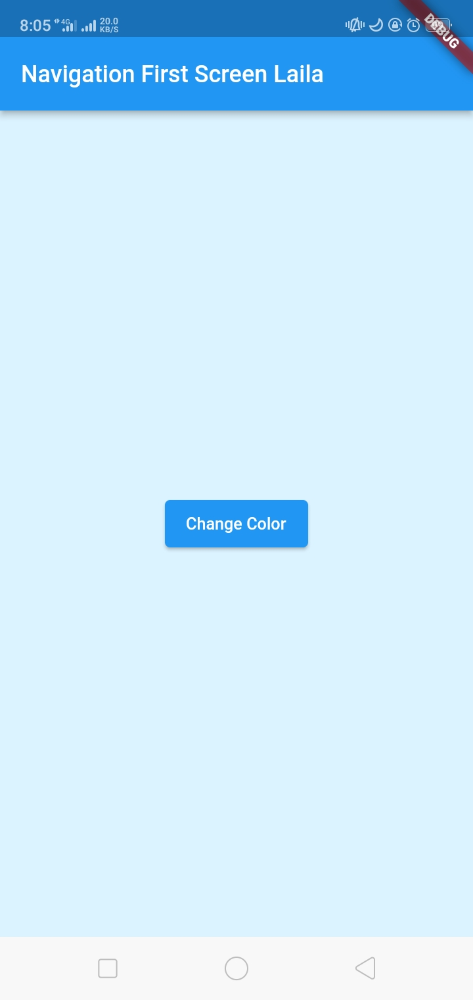

# Pemrograman Mobile

## Pemrograman Asynchronous

- **Nama:** Lailatul Badriyah
- **NIM:** 2141720036
- **Kelas:** TI-3H
- **No Absen:** 14

# **Praktikum**

## **Praktikum 1: Mengunduh Data dari Web Service (API)**

### Soal 1

Tambahkan nama panggilan Anda pada `title` app sebagai identitas hasil pekerjaan Anda.

### Jawab:

`main.dart`

```Dart
import 'package:flutter/material.dart';
import 'dart:async';
import 'package:http/http.dart';
import 'package:http/http.dart' as http;

void main() {
  runApp(const MyApp());
}

class MyApp extends StatelessWidget {
  const MyApp({super.key});

  // This widget is the root of your application.
  @override
  Widget build(BuildContext context) {
    return MaterialApp(
      title: 'Flutter Demo Laila',
      theme: ThemeData(
        primarySwatch: Colors.blue,
        visualDensity: VisualDensity.adaptivePlatformDensity,
      ),
      home: const FuturePage(),
    );
  }
}

class FuturePage extends StatefulWidget {
  const FuturePage({super.key});

  @override
  State<FuturePage> createState() => _FuturePageState();
}

class _FuturePageState extends State<FuturePage> {
  String result = '';
  bool isLoading = false;
  @override
  Widget build(BuildContext context) {
    return Scaffold(
      appBar: AppBar(
        title: const Text('Back from the Future Laila'),
      ),
      body: Center(
        child: Column(children: [
          const Spacer(),
          ElevatedButton(
            child: Text('GO!'),
            onPressed: () {
              setState(() {
                isLoading = true;
              });
              Future.delayed(Duration(seconds: 1)).then(((value) {
                getData().then((value) {
                  result = value.body.toString().substring(0, 450);
                  setState(() {
                    isLoading = false;
                  });
                }).catchError((e) {
                  result = "An error occured $e";
                  setState(() {
                    isLoading = false;
                  });
                });
              }));
            },
          ),
          const Spacer(),
          isLoading ? CircularProgressIndicator() : Text(result),
          const Spacer(),
        ]),
      ),
    );
  }

  Future<Response> getData() async {
    const authority = 'www.googleapis.com';
    const path = '/books/v1/volumes/tZldEAAAQBAJ';
    Uri url = Uri.https(authority, path);
    return await http.get(url);
  }
}
```
### Soal 2

- Carilah judul buku favorit Anda di Google Books, lalu ganti ID buku pada variabel `path` di kode tersebut. Caranya ambil di URL browser Anda seperti gambar berikut ini.

### Jawab:


- Kemudian cobalah akses di browser URI tersebut dengan lengkap seperti ini. Jika menampilkan data JSON, maka Anda telah berhasil. Lakukan capture milik Anda dan tulis di README pada laporan praktikum. Lalu lakukan commit dengan pesan "W12: Soal 2".

### Jawab:


### Soal 3

- Jelaskan maksud kode langkah 5 tersebut terkait `substring` dan `catchError`!

### Jawab:
Pada langkah 5, terdapat metode `substring(0, 450)` yang digunakan untuk mengambil sebagian dari teks dari hasil permintaan data. Fungsi `substring` digunakan untuk memotong teks, dalam hal ini, dimulai dari indeks 0 hingga indeks 449, sehingga hanya sebagian tertentu dari hasil permintaan yang ditampilkan. Selain itu, terdapat penggunaan metode `catchError` setelah blok `then`, yang berfungsi untuk menangani kesalahan yang mungkin terjadi selama proses pengambilan data. Jika terjadi kesalahan, blok kode di dalam `catchError` akan dieksekusi, dan variabel `result` akan diatur sebagai **'An error occurred'**. Setelah itu, `setState` dipanggil untuk memperbarui antarmuka pengguna dengan menampilkan hasil atau pesan kesalahan yang sesuai.

- Capture hasil praktikum Anda berupa GIF dan lampirkan di `README`. Lalu lakukan commit dengan pesan "W12: Soal 3".

### Jawab:


## **Praktikum 2: Menggunakan await/async untuk menghindari callbacks**

`main.dart`

```Dart
import 'package:flutter/material.dart';
import 'dart:async';
import 'package:http/http.dart';
import 'package:http/http.dart' as http;

void main() {
  runApp(const MyApp());
}

class MyApp extends StatelessWidget {
  const MyApp({super.key});

  // This widget is the root of your application.
  @override
  Widget build(BuildContext context) {
    return MaterialApp(
      title: 'Flutter Demo Laila',
      theme: ThemeData(
        primarySwatch: Colors.blue,
        visualDensity: VisualDensity.adaptivePlatformDensity,
      ),
      home: const FuturePage(),
    );
  }
}

class FuturePage extends StatefulWidget {
  const FuturePage({super.key});

  @override
  State<FuturePage> createState() => _FuturePageState();
}

class _FuturePageState extends State<FuturePage> {
  String result = '';
  @override
  Widget build(BuildContext context) {
    return Scaffold(
      appBar: AppBar(
        title: const Text('Back from the Future Laila'),
      ),
      body: Center(
        child: Column(
          mainAxisAlignment: MainAxisAlignment.center,
          children: [
            const Spacer(),
            ElevatedButton(
                // onPressed: () {
                //   setState(() {});
                //   getData().then((value) {
                //     result = value.body.toString().substring(0, 450);
                //     setState(() {});
                //   }).catchError((_) {
                //     result = 'An error occurred';
                //     setState(() {});
                //   });
                // },
                onPressed: count,
                child: const Text("GO!")),
            const Spacer(),
            Text(result),
            const Spacer(),
            const CircularProgressIndicator(),
            const Spacer()
          ],
        ),
      ),
    );
  }

  Future<Response> getData() async {
    const authority = 'www.googleapis.com';
    const path = '/books/v1/volumes/tZldEAAAQBAJ';
    Uri url = Uri.https(authority, path);
    return await http.get(url);
  }

  Future<int> returnOneAsync() async {
    await Future.delayed(const Duration(seconds: 3));
    return 1;
  }

  Future<int> returnTwoAsync() async {
    await Future.delayed(const Duration(seconds: 3));
    return 2;
  }

  Future<int> returnThreeAsync() async {
    await Future.delayed(const Duration(seconds: 3));
    return 3;
  }

  Future count() async {
    int total = 0;
    total = await returnOneAsync();
    total += await returnTwoAsync();
    total += await returnThreeAsync();
    setState(() {
      result = total.toString();
    });
  }
}

```
### Soal 4

- Jelaskan maksud kode langkah 1 dan 2 tersebut!

### Jawab:

Pada langkah 1, dilakukan penambahan tiga method baru dalam kelas `_FuturePageState`. Metode-metode ini, yaitu `returnOneAsync`, `returnTwoAsync`, dan  `returnThreeAsync`, sebenarnya melakukan operasi asinkron yang mensimulasikan penundaan selama 3 detik dan mengembalikan nilai 1, 2, dan 3 secara berturut-turut.

Pada langkah 2, dilakukan penambahan method `count`. Method ini memiliki tiga pemanggilan fungsi asinkron `(await)` ke metode-metode yang telah ditambahkan sebelumnya. Method `count` menghitung jumlah total dari hasil yang dikembalikan oleh metode-metode asinkron dan kemudian mengatur nilai `result` dalam state untuk menampilkan hasilnya.

- Capture hasil praktikum Anda berupa GIF dan lampirkan di `README`. Lalu lakukan commit dengan pesan "W12: Soal 4".

### Jawab:


## **Praktikum 3: Menggunakan Completer di Future**

`main.dart`

```Dart
import 'package:flutter/material.dart';
import 'dart:async';
import 'package:http/http.dart';
import 'package:http/http.dart' as http;
import 'package:async/async.dart';

void main() {
  runApp(const MyApp());
}

class MyApp extends StatelessWidget {
  const MyApp({super.key});

  // This widget is the root of your application.
  @override
  Widget build(BuildContext context) {
    return MaterialApp(
      title: 'Flutter Demo Laila',
      theme: ThemeData(
        primarySwatch: Colors.blue,
        visualDensity: VisualDensity.adaptivePlatformDensity,
      ),
      home: const FuturePage(),
    );
  }
}

class FuturePage extends StatefulWidget {
  const FuturePage({super.key});

  @override
  State<FuturePage> createState() => _FuturePageState();
}

class _FuturePageState extends State<FuturePage> {
  String result = '';
  late Completer completer;

  @override
  Widget build(BuildContext context) {
    return Scaffold(
      appBar: AppBar(
        title: const Text('Back from the Future Laila'),
      ),
      body: Center(
        child: Column(
          mainAxisAlignment: MainAxisAlignment.center,
          children: [
            const Spacer(),
            ElevatedButton(
              onPressed: () {
                getNumber().then((value) {
                  setState(() {
                    result = value.toString();
                  });
                }).catchError((e) {
                  result = 'An error Occured';
                });
              },
              child: const Text("GO!"),
            ),
            const Spacer(),
            Text(result),
            const Spacer(),
            const CircularProgressIndicator(),
            const Spacer()
          ],
        ),
      ),
    );
  }

  Future getNumber() {
    completer = Completer<int>();
    calculate();
    return completer.future;
  }

  calculate() async {
    try {
      await Future.delayed(const Duration(seconds: 5));
      completer.complete(42);
    } catch (e) {
      completer.completeError({});
    }
  }

  Future<Response> getData() async {
    const authority = 'www.googleapis.com';
    const path = '/books/v1/volumes/tZldEAAAQBAJ';
    Uri url = Uri.https(authority, path);
    return await http.get(url);
  }

  Future<int> returnOneAsync() async {
    await Future.delayed(const Duration(seconds: 3));
    return 1;
  }

  Future<int> returnTwoAsync() async {
    await Future.delayed(const Duration(seconds: 3));
    return 2;
  }

  Future<int> returnThreeAsync() async {
    await Future.delayed(const Duration(seconds: 3));
    return 3;
  }

  Future count() async {
    int total = 0;
    total = await returnOneAsync();
    total += await returnTwoAsync();
    total += await returnThreeAsync();
    setState(() {
      result = total.toString();
    });
  }
}
```

### Soal 5

- Jelaskan maksud kode langkah 2 tersebut!

### Jawab:

Langkah 2 dalam kode tersebut memberikan pengenalan konsep `Completer` dalam Flutter. Pertama mendeklarasikan variabel `completer` sebagai `late Completer`, yang artinya nilai variabel ini akan diinisialisasi sebelum digunakan. Selanjutnya ada dua metode yang ditambahkan.

Method pertama, `getNumber` yang bertugas membuat sebuah `Completer`, lalu memanggil method lain yaitu `calculate`. Kemudian methodeini mengembalikan `future` dari `completer`. `Future` ini yang nantinya menjadi janji bahwa suatu nilai akan tersedia di masa depan.

Method kedua, `calculate` yang mensimulasikan operasi yang membutuhkan waktu dengan cara menunda selama 5 detik menggunakan `await Future.delayed(...)`. Setelah itu, nilai `completer` diisi dengan angka 42, yang artinya operasi ini telah selesai.

- Capture hasil praktikum Anda berupa GIF dan lampirkan di `README`. Lalu lakukan commit dengan pesan "W12: Soal 5".

### Jawab


### Soal 6

- Jelaskan maksud perbedaan kode langkah 2 dengan langkah 5-6 tersebut!

### Jawab:

Pada langkah 2 tidak menangani error secara eksplisit. Sementara itu, langkah 5 mengubah metode `calculate` dengan menambahkan blok `try-catch`. Jika terjadi kesalahan selama operasi asinkron (misalnya, penundaan gagal), blok `catch` akan menangkap kesalahan tersebut, dan `completer` akan diselesaikan dengan sebuah objek kosong `{}`. Langkah 6 adalah bagian dari fungsi `onPressed` pada tombol "GO!" yang memanggil metode `getNumber`. Pada langkah ini, setelah pemanggilan `getNumber`, `then` digunakan untuk menangkap hasilnya. Dalam blok `then`, nilai hasil dikonversi menjadi string dan diperbarui ke dalam variabel `result` melalui `setState`. Jika ada kesalahan, `catchError` akan menangkapnya dan mengatur `result` ke string "An error Occurred".

- Capture hasil praktikum Anda berupa GIF dan lampirkan di `README`. Lalu lakukan commit dengan pesan "W12: Soal 6".

### Jawab:


## **Praktikum 4: Memanggil Future secara paralel**

`main.dart`

```Dart
import 'package:flutter/material.dart';
import 'dart:async';
import 'package:http/http.dart';
import 'package:http/http.dart' as http;
import 'package:async/async.dart';

void main() {
  runApp(const MyApp());
}

class MyApp extends StatelessWidget {
  const MyApp({super.key});

  // This widget is the root of your application.
  @override
  Widget build(BuildContext context) {
    return MaterialApp(
      title: 'Flutter Demo Laila',
      theme: ThemeData(
        primarySwatch: Colors.blue,
        visualDensity: VisualDensity.adaptivePlatformDensity,
      ),
      home: const FuturePage(),
    );
  }
}

class FuturePage extends StatefulWidget {
  const FuturePage({super.key});

  @override
  State<FuturePage> createState() => _FuturePageState();
}

class _FuturePageState extends State<FuturePage> {
  String result = '';
  late Completer completer;

  @override
  Widget build(BuildContext context) {
    return Scaffold(
      appBar: AppBar(
        title: const Text('Back from the Future Laila'),
      ),
      body: Center(
        child: Column(
          mainAxisAlignment: MainAxisAlignment.center,
          children: [
            const Spacer(),
            ElevatedButton(
              onPressed: returnFG,
              child: const Text("GO!"),
            ),
            const Spacer(),
            Text(result),
            const Spacer(),
            const CircularProgressIndicator(),
            const Spacer()
          ],
        ),
      ),
    );
  }

  Future getNumber() {
    completer = Completer<int>();
    calculate();
    return completer.future;
  }

  calculate() async {
    try {
      await Future.delayed(const Duration(seconds: 5));
      completer.complete(42);
    } catch (e) {
      completer.completeError({});
    }
  }

  void returnFG() {
    final futures = Future.wait<int>([
      returnOneAsync(),
      returnTwoAsync(),
      returnThreeAsync(),
    ]);
    // FutureGroup<int> futureGroup = FutureGroup<int>();
    // futureGroup.add(returnOneAsync());
    // futureGroup.add(returnTwoAsync());
    // futureGroup.add(returnThreeAsync());
    // futureGroup.close();
    futures.then((value) {
      int total = 0;
      for (var element in value) {
        total += element;
      }
      setState(() {
        result = total.toString();
      });
    });
  }

  Future<Response> getData() async {
    const authority = 'www.googleapis.com';
    const path = '/books/v1/volumes/tZldEAAAQBAJ';
    Uri url = Uri.https(authority, path);
    return await http.get(url);
  }

  Future<int> returnOneAsync() async {
    await Future.delayed(const Duration(seconds: 3));
    return 1;
  }

  Future<int> returnTwoAsync() async {
    await Future.delayed(const Duration(seconds: 3));
    return 2;
  }

  Future<int> returnThreeAsync() async {
    await Future.delayed(const Duration(seconds: 3));
    return 3;
  }

  Future count() async {
    int total = 0;
    total = await returnOneAsync();
    total += await returnTwoAsync();
    total += await returnThreeAsync();
    setState(() {
      result = total.toString();
    });
  }
}
```

### Soal 7

Capture hasil praktikum Anda berupa GIF dan lampirkan di `README`. Lalu lakukan commit dengan pesan "W12: Soal 7".

### Jawab:


### Soal 8

Jelaskan maksud perbedaan kode langkah 1 dan 4!

### Jawab:

Langkah 1, menggunakan objek `FutureGroup` untuk mengelola sekelompok `Future`. Setiap `Future` ditambahkan ke dalam `FutureGroup` menggunakan methode `add`. Selanjutnya, method `close` dipanggil untuk menandai akhir dari grup `Future`. Setelah itu, `FutureGroup.future` digunakan untuk mendapatkan `Future` tunggal yang menunggu kelompok `Future` selesai. Kemudian, hasil dari setiap `Future` dijumlahkan untuk menghitung total, dan hasilnya diperbarui dalam UI melalui penggunaaan  `setState`.

Sedangkan pada langkah 4, digunakan fungsi `Future.wait` untuk menunggu sejumlah `Future` selesai. Daftar `Future` yang akan ditunggu diatur dalam bentuk `list`, dan `Future.wait` secara langsung menunggu semua `Future` dalam `list` selesai. Setelah itu, hasil dari setiap `Future` dijumlahkan untuk menghitung total, dan hasilnya diperbarui dalam UI melalui `setState`.

Perbedaan utama antara keduanya terletak pada cara mengelola dan menunggu kelompok `Future`. Langkah 1 menggunakan objek `FutureGroup`, sedangkan Langkah 4 langsung menggunakan `Future.wait` untuk menangani beberapa `Future` secara bersamaan. Langkah 4 dapat dianggap lebih langsung dan mudah dipahami, sementara Langkah 1 menunjukkan pendekatan yang lebih modular dengan penggunaan objek `FutureGroup`.

## **Praktikum 5: Menangani Respon Error pada Async Code**

### Soal 9

Capture hasil praktikum Anda berupa GIF dan lampirkan di `README`. Lalu lakukan commit dengan pesan "W12: Soal 9".

### Jawab:


### Soal 10

Panggil method `handleError()` tersebut di `ElevatedButton`, lalu run. Apa hasilnya? Jelaskan perbedaan kode langkah 1 dan 4!

### Jawab:

Setelah method `handleError()` dipanggil, maka outputnya akan tetap sama yaitu pesan kesalahan **'Exception: Something terrible happened!'** akan tetap ditampilkan. Namun kedua kode pada langkah 1 dan 4 tersebut memiliki perbedaan dalam menangani error yang terjadi.

Pada langkah 1, meskipun method `returnError()` melemparkan pengecualian, tidak ada blok `try-catch` di sekitarnya. Oleh karena itu, ketika memanggil `returnError()`, pengecualian akan diteruskan tanpa ditangani. Ini dapat menyebabkan aplikasi berhenti atau menampilkan pesan kesalahan tanpa penanganan khusus.

Pada langkah 4, method `handleError()` akan mengeksekusi `returnError()` dalam blok `try`. Jika ada kesalahan selama eksekusi `returnError()`, blok `catch` akan dijalankan, dan pesan kesalahan akan diperbarui dalam `setState`. Oleh karena itu, setelah pemanggilan `handleError()`, meskipun pesan kesalahan tetap sama, aplikasi dapat melanjutkan berjalan karena penanganan kesalahan yang dilakukan di dalam blok `catch`.

## **Praktikum 6: Menggunakan Future dengan StatefulWidget**

### Soal 11

Tambahkan nama panggilan Anda pada tiap properti title sebagai identitas pekerjaan Anda.

### Jawab:


### Soal 12

- Jika Anda tidak melihat animasi loading tampil, kemungkinan itu berjalan sangat cepat. Tambahkan delay pada method getPosition() dengan kode await Future.delayed(const Duration(seconds: 3));

- Apakah Anda mendapatkan koordinat GPS ketika run di browser? Mengapa demikian?

### Jawab:

Jika menjalankan di browser, koordinat GPS masih dapat muncul atau diperoleh. Ini disebabkan oleh Flutter web yang menggunakan API Geolocation langsung dari browser. Pada Flutter web, izin untuk mengakses lokasi dikelola oleh browser, bukan oleh sistem operasi (seperti Android pada perangkat seluler). Oleh karena itu, meskipun tidak menambahkan izin secara langsung ke `AndroidManifest`, koordinat GPS masih dapat diperoleh di browser, tetapi tetap memerlukan izin dari pengguna.

Berikut hasil ketika dijalankan di browser:


- Capture hasil praktikum Anda berupa GIF dan lampirkan di `README`. Lalu lakukan commit dengan pesan "W12: Soal 12".

### Jawab:


## **Praktikum 7: Manajemen Future dengan FutureBuilder**

### Soal 13

- Apakah ada perbedaan UI dengan praktikum sebelumnya? Mengapa demikian?

### Jawab:

Dari kedua praktikum tersebut tidak memiliki perbedaan UI. Keduanya tetap menampilkan koordinat Geolokasi dengan layout yang sama. Hal ini terjadi karena keduanya masih mengambil lokasi secara sinkron dalam blok `initState`. Pada tampilan UI keduanya memiliki delay yang sama, yaitu 3 detik. Selain itu, UI dapat terlihat sama karena `FutureBuilder` secara otomatis mengelola pembaruan UI, bahkan tanpa pemanggilan `setState` langsung.

- Capture hasil praktikum Anda berupa GIF dan lampirkan di `README`. Lalu lakukan commit dengan pesan "W12: Soal 13".

### Jawab:


- Seperti yang Anda lihat, menggunakan FutureBuilder lebih efisien, clean, dan reactive dengan Future bersama UI.

### Soal 14

- Apakah ada perbedaan UI dengan langkah sebelumnya? Mengapa demikian?

### Jawab:

Tidak ada perbedaan UI dengan langkah sebelumnya. Hal ini dikarenakan pada langkah ini hanya menambahkan `handleError()` yang akan dijalankan ketika terdapat kesalahan. Namun karena pada langkah ini tidak ada kesalahan yang terjadi selama pemrosesan data lokasi. Oleh karena itu, pesan **Something terrible happened!** dari blok penanganan kesalahan tidak ditampilkan.

- Capture hasil praktikum Anda berupa GIF dan lampirkan di `README. Lalu lakukan commit dengan pesan "W12: Soal 14".


## **Praktikum 8: Navigation route dengan Future Function**

### Soal 15

- Tambahkan nama panggilan Anda pada tiap properti title sebagai identitas pekerjaan Anda.
- Silakan ganti dengan warna tema favorit Anda.

### Jawab:

