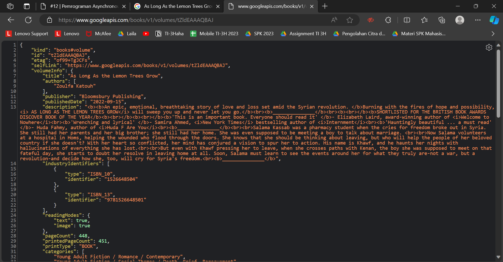

# Pemrograman Mobile

## Pemrograman Asynchronous

- **Nama:** Lailatul Badriyah
- **NIM:** 2141720036
- **Kelas:** TI-3H
- **No Absen:** 14

# **Praktikum**

## **Praktikum 1: Mengunduh Data dari Web Service (API)**

### Soal 1

Tambahkan nama panggilan Anda pada `title` app sebagai identitas hasil pekerjaan Anda.

### Jawab:

`main.dart`

```Dart
import 'package:flutter/material.dart';
import 'dart:async';
import 'package:http/http.dart';
import 'package:http/http.dart' as http;

void main() {
  runApp(const MyApp());
}

class MyApp extends StatelessWidget {
  const MyApp({super.key});

  // This widget is the root of your application.
  @override
  Widget build(BuildContext context) {
    return MaterialApp(
      title: 'Flutter Demo Laila',
      theme: ThemeData(
        primarySwatch: Colors.blue,
        visualDensity: VisualDensity.adaptivePlatformDensity,
      ),
      home: const FuturePage(),
    );
  }
}

class FuturePage extends StatefulWidget {
  const FuturePage({super.key});

  @override
  State<FuturePage> createState() => _FuturePageState();
}

class _FuturePageState extends State<FuturePage> {
  String result = '';
  bool isLoading = false;
  @override
  Widget build(BuildContext context) {
    return Scaffold(
      appBar: AppBar(
        title: const Text('Back from the Future Laila'),
      ),
      body: Center(
        child: Column(children: [
          const Spacer(),
          ElevatedButton(
            child: Text('GO!'),
            onPressed: () {
              setState(() {
                isLoading = true;
              });
              Future.delayed(Duration(seconds: 1)).then(((value) {
                getData().then((value) {
                  result = value.body.toString().substring(0, 450);
                  setState(() {
                    isLoading = false;
                  });
                }).catchError((e) {
                  result = "An error occured $e";
                  setState(() {
                    isLoading = false;
                  });
                });
              }));
            },
          ),
          const Spacer(),
          isLoading ? CircularProgressIndicator() : Text(result),
          const Spacer(),
        ]),
      ),
    );
  }

  Future<Response> getData() async {
    const authority = 'www.googleapis.com';
    const path = '/books/v1/volumes/tZldEAAAQBAJ';
    Uri url = Uri.https(authority, path);
    return await http.get(url);
  }
}
```
### Soal 2

- Carilah judul buku favorit Anda di Google Books, lalu ganti ID buku pada variabel `path` di kode tersebut. Caranya ambil di URL browser Anda seperti gambar berikut ini.

### Jawab:


- Kemudian cobalah akses di browser URI tersebut dengan lengkap seperti ini. Jika menampilkan data JSON, maka Anda telah berhasil. Lakukan capture milik Anda dan tulis di README pada laporan praktikum. Lalu lakukan commit dengan pesan "W12: Soal 2".

### Jawab:



### Soal 3

- Jelaskan maksud kode langkah 5 tersebut terkait `substring` dan `catchError`!

### Jawab:
Pada langkah 5, terdapat metode `substring(0, 450)` yang digunakan untuk mengambil sebagian dari teks dari hasil permintaan data. Fungsi `substring` digunakan untuk memotong teks, dalam hal ini, dimulai dari indeks 0 hingga indeks 449, sehingga hanya sebagian tertentu dari hasil permintaan yang ditampilkan. Selain itu, terdapat penggunaan metode `catchError` setelah blok `then`, yang berfungsi untuk menangani kesalahan yang mungkin terjadi selama proses pengambilan data. Jika terjadi kesalahan, blok kode di dalam `catchError` akan dieksekusi, dan variabel `result` akan diatur sebagai **'An error occurred'**. Setelah itu, `setState` dipanggil untuk memperbarui antarmuka pengguna dengan menampilkan hasil atau pesan kesalahan yang sesuai.

- Capture hasil praktikum Anda berupa GIF dan lampirkan di `README`. Lalu lakukan commit dengan pesan "W12: Soal 3".

### Jawab:

