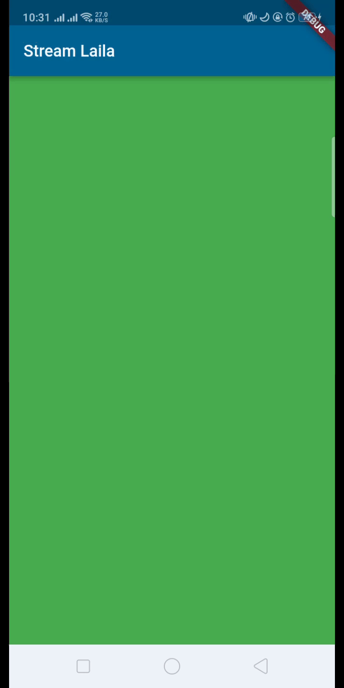
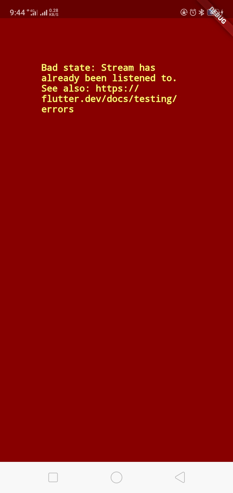
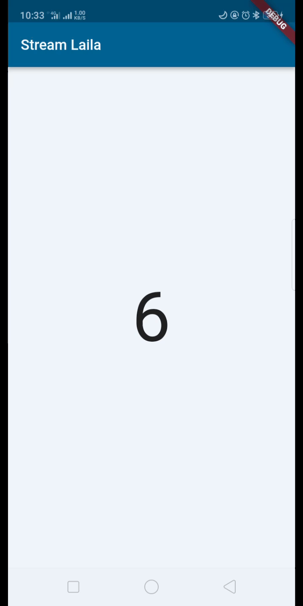

# Pemrograman Mobile

## Lanjutan State Management dengan Streams

- **Nama:** Lailatul Badriyah
- **NIM:** 2141720036
- **Kelas:** TI-3H
- **No Absen:** 14

# **Praktikum**

## **Praktikum 1: Dart Streams**

### Soal 1

- Tambahkan **nama panggilan Anda** pada `title app` sebagai identitas hasil pekerjaan Anda.
- Gantilah warna tema aplikasi sesuai kesukaan Anda.
- Lakukan commit hasil jawaban Soal 1 dengan pesan **"W13: Jawaban Soal 1"**

### Jawab:

```Dart
import 'package:flutter/material.dart';

void main() {
  runApp(const MyApp());
}

class MyApp extends StatelessWidget {
  const MyApp({super.key});

  // This widget is the root of your application.
  @override
  Widget build(BuildContext context) {
    return MaterialApp(
        title: 'Stream Laila',
        theme: ThemeData(
            colorScheme: ColorScheme.fromSeed(
                seedColor: const Color.fromARGB(255, 164, 214, 255))),
        home: const StreamHomePage());
  }
}

class StreamHomePage extends StatefulWidget {
  const StreamHomePage({super.key});

  @override
  State<StreamHomePage> createState() => _StreamHomePageState();
}

class _StreamHomePageState extends State<StreamHomePage> {
  @override
  Widget build(BuildContext context) {
    return Container();
  }
}
```

### Soal 2

- Tambahkan 5 warna lainnya sesuai keinginan Anda pada variabel `colors` tersebut.
- Lakukan commit hasil jawaban Soal 2 dengan pesan **"W13: Jawaban Soal 2"**

### Jawab:

```Dart
import 'package:flutter/material.dart';

class ColorSrean {
  final List<Color> colors = [
    Colors.blueGrey,
    Colors.amber,
    Colors.deepPurple,
    Colors.lightBlue,
    Colors.teal,
    Colors.green,
    Colors.cyan,
    Colors.yellow,
    Colors.indigo,
    Colors.pink
  ];
}
```

### Soal 3

- Jelaskan fungsi keyword `yield*` pada kode tersebut!

### Jawab:

Keyword `yield*` dalam kode tersebut digunakan untuk menggabungkan nilai dari objek iterable ke dalam stream yang dihasilkan oleh fungsi `getColors`. Pada baris `yield* Stream.periodic(...)`, `yield*` memungkinka nilai-nilai yang dihasilkan oleh objek iterable dari `Stream.periodic` yang berisi daftar warna untuk disertakan secara berurutan ke dalam `stream` utama. Dengan kata lain, setiap detik, `stream` akan menghasilkan warna baru dari daftar warna yang telah ditentukan. 

- Apa maksud isi perintah kode tersebut?

### Jawab:

Pada kode tersebut mendefinisikan class `ColorStream` yang memiliki daftar warna dan sebuah metode `getColors` yang mengembalikan `stream` warna. Class ini menggunakan `Stream.periodic` untuk menghasilkan nilai dengan selang waktu tertentu yaitu setiap detik. Melalui penggunaan `yield`, setiap nilai yang dihasilkan oleh `stream` adalah warna dari daftar warna yang telah ditentukan.

Dengan kata lain, tujuan dari perintah kode tersebut adalah menciptakan stream warna yang terus menerus dan berulang dengan rentang waktu sary detik.

- Lakukan commit hasil jawaban Soal 3 dengan pesan **"W13: Jawaban Soal 3"**

### Jawab:

Done

### Soal 4

- Capture hasil praktikum Anda berupa GIF dan lampirkan di `README`.

### Jawab:



- Lakukan commit hasil jawaban Soal 4 dengan pesan **"W13: Jawaban Soal 4"**

### Jawab:

Done

### Soal 5

- Jelaskan perbedaan menggunakan `listen` dan `await for` (langkah 9)!

### Jawab:

Perbedaan menggunakan `listen` dan `await for`

- `listen` digunakan untuk memasang pendengar pada `stream`. Dalam konteks ini, ketika `stream` menghasilkan nilai baru, `callback` yang terkadung dalam `listen` akan diaktifkan. Dalam kode ini, tidak ada penggunaan `await`, sehingga pembaruan tampilan dapat terjadi secara asinkronus, sehingga blok `setState` akan diekseskusi setiap kali `stream` mengeluarkan nilai baru.

- `await for` digunakan unutuk mendengarkan `stream` secara langsung di dalam metode `changeColor()`. Dengan kata lain, penggunaan kata kunci `await` memastikan bahwa setiap langkah di dalam blok perulangan akan menunggu hingga `stream` menghasilkan nilai sebeluum melanjutkan ke langkah berikutnya. Dalam situasi ini, ketika `stream` menghasilkan nilai baru (warna baru), blok `setState` dieksekusi untuk memperbarui tampilan, menciptakan respons yang sesuai dengan perubahan nilai dalam `stream`.

- Pada intinya, penggunaan `await for` terjadi ketika kita perlu menunda proses hingga setiap iterasi `stream` selesai sebelum melanjutkan ke iterasi berikutnya. Sementara itu, penggunaan `listen` diterapkan ketika kita ingin menangani nilai secara asinkron, memungkinkan kelanjutan ke iterasi berikutnya tanpa harus menunggu penyelesaian satu iterasi sebelumnya.

- Lakukan commit hasil jawaban Soal 5 dengan pesan **"W13: Jawaban Soal 5"**

### Jawab:

Done

## **Praktikum 2: Stream Controllers dan Sinks**

### Soal 6

- Jelaskan maksud kode langkah 8 dan 10 tersebut!

### Jawab:

Pada **langkah 8** tersebut mencakup pengaturan awal untuk mengelola aliran data atau `stream` angka. Pada bagian ini, objek `NumberStream` dibuat dan diinisialisasi, termasuk juga pengambilan controller dari objek tersebut. Controller ini digunakan untuk mengontrol aliran data dan mendapatkan objek `Stream` dari controller, serta menambahkan listener ke aliran data. Dalam hal ini, ketika ada data baru yang diterima di aliran, fungsi yang ditentukan dalam blok `listen` akan dijalankan. Fungsi ini menggunakan `setState` untuk memperbarui state dengan nilai terbaru dari aliram, yang dalam konteks ini disimpan sebagai `lastNumber`.

**Langkah 10** terdiri dari fungsi `addRandomNumber()`, yang bertujuan untuk menambahkan angka acak ke aliran data. Dalam fungsi ini, objek `Random` dibuat untuk menghasilkan angka acak antara 0 dan 9. Angka acak ini kemudian ditambahkan ke `sink` pada objek `NumberStream`. Dengan melakukan hal ini, nilai yang ditambahkan akan dikirimkan ke semua `listener` yang telah didaftarkan ke aliran data tersebut, sehingga memungkinkan tindakan tertentu diambil ketika ada perubahan nilai dalam aliran data.

- Capture hasil praktikum Anda berupa GIF dan lampirkan di README.

### Jawab:


- Lalu lakukan commit dengan pesan "W13: Jawaban Soal 6".

### Jawab:

Done

### Soal 7

- Jelaskan maksud kode langkah 13 sampai 15 tersebut!

### Jawab:

Kode pada langkah 13 hingga 15 akan membuat handling ketika terjadi error menggunakan metode `addError()` dalam class `stream.dart`. Dalam konteks ini, jika terjadi error atau kesalahan selama proses iterasi atau saat `stream` menghasilkann ilai, maka fungsi `addError()` dipanggil untuk menangani situasi tersebut. Sebagai hasil dari penanganan kesalahan, nilai variabel dari `lastNumber` akan diatur menjadi -1.

- Kembalikan kode seperti semula pada Langkah 15, comment addError() agar Anda dapat melanjutkan ke praktikum 3 berikutnya.

### Jawab:

Done

- Lalu lakukan commit dengan pesan "W13: Jawaban Soal 7".

### Jawab:

Done

## **Praktikum 3: Injeksi Data ke Streams**

### Soal 8

- Jelaskan maksud kode langkah 1-3 tersebut!

### Jawab:

Pada **langkah 1** dilakukan deklarasi variabel `transformer` dengan kata kunci `late`, yang berarti nilai dari variabel ini akan diinisialisasi kemudian. Tipe datanya adalah `StreamTransformer` yang digunakan untuk mengubah `stream` dengan mengaplikasikan transformasi tertentu. Kemudian pada **langkah 2** dilakukan inisialisasi variabel `transformer` dengan menggunakan metode statis `.fromHandlers()` pada `StreamTransformer`. Metode ini menerima 3 fungsi handler yaitu: `handleData` yang dipanggil ketika ada data baru dalam `stream`. Setiap nilai baru dikalikan dengan 10 dan kemudian ditambahkan ke `sink` yang merupakan bagian dari aliran data keluar, `handleError` yang dipanggil ketika terjadi kesalahan dalam `stream`. Jika terjadi kesalahan, -1 akan ditambahkan ke `sink`, `handleDone` yang dipanggil ketika `stream` selesai. Dalam hal ini, `sink` akan ditutup `(sink.close())`. Terakhir, pada **langkah 3** menggunakan `transform` untuk menerapkan `transformer` pada `stream` tertentu. Selanjutnya, memanggil `listen` untuk mendengarkan perubahan pada `stream` yang telah diubah. Ketika `stream` menghasilkan data yang telah diubah, fungsi yang didefinisikan di dalam blok `listen` akan dieksekusi dan data tersebut dapat dimanfaatkan sesuai dengan kebutuhkan pada implementasi selanjutnya.

- Capture hasil praktikum Anda berupa GIF dan lampirkan di README.

### Jawab:


- Lalu lakukan commit dengan pesan "W13: Jawaban Soal 8".

### Jawab:

Done

## **Praktikum 4: Subscribe ke stream events**

### Soal 9

- Jelaskan maksud kode langkah 2, 6 dan 8 tersebut!

### Jawab:

Pada **langkah 2** maksudnya adalah untuk melakukan langganan (subscribe) pada `stream`, sehingga dapat memperoleh informasi atau output yang dihasilkan oleh `stream` tersebut. Kemudian pada **langkah 6** terdapat pemanggilan method `cancel` pada objek `subscription` terhadap `stream`, sehingga `listener` tidak akan menerima pembaruan lebih lanjut dari `stream` tersebut setelah pemanggilan ini. Hal ini dapat berguna saat `widget` dihapus atau tidak lagi memerlukan pembaruan dari `stream` tertentu. Terakhir, pada **langkah 8**, function `addRandomNumber()` akan menghasilkan angka acak antara 0-9 dan kemudian menambahkannya ke `sink` di objek `numberStream`. Namun, sebelum melakukan itu, fungsi memeriksa apakah `sink` telah ditutup. Jika `sink` masih terbuka, random number akan ditambahkan ke dalam stream, jika tidak, nilai `lastNumber` diatur menjadi -1 melalui `setState`. Hal ini untuk mengantisipasi situasi di mana `stream` telah ditutup dan tidak bisa menerima data lebih lanjut. 

- Capture hasil praktikum Anda berupa GIF dan lampirkan di README.

### Jawab:


- Lalu lakukan commit dengan pesan "W13: Jawaban Soal 9".

### Jawab:

Done

## **Praktikum 5: Multiple Stream Subscriptions**

### Soal 10

Jelaskan mengapa error itu bisa terjadi ?

### Jawab:

Error tersebut terjadi saat mencoba menambahkan atau membuat dua `subscription` pada `stream` yang sama tanpa membatalkan `subscription` sebelumnya. Situasi ini terjadi ketika `subscription2` diinisialisasi dalam metode `initState()`, padahal `subscription` pertama sudah ada untuk menangani `stream` yang sama pada saat yang bersamaan.



### Soal 11

- Jelaskan mengapa hal itu bisa terjadi ?

### Jawab:

Pada saat tombol `New Random Number` ditekan, dua angka yang identik akan dihasilkan. Hal ini merupakan keluaran dari `stream` yang dipanggil oleh objek `subscription` dan `subscription2`, yang menghasilkan nilai berupa `event` (angka acak) yang dipisahkan oleh tanda '-'. Pada saat tombol `'Stop Stream'` ditekan, langganan terhadap `stream` akan dihentikan, dan meskipun tombol `New Random Number` tetap ditekan, output tidak akan dihasilkan lagi.

- Capture hasil praktikum Anda berupa GIF dan lampirkan di README.

### Jawab:


- Lalu lakukan commit dengan pesan "W13: Jawaban Soal 10,11".

### Jawab:

Done

## **Praktikum 6: StreamBuilder**

### Soal 12

- Jelaskan maksud kode pada langkah 3 dan 7 !

### Jawab:

Pada **langkah 3**, terdapat method `getNumbers` pada kelas `NumberStream`. Method ini menghasilkan sebuah `Stream<int>` yang bertindak sebagai aliran data periodik. Dengan menggunakan `Stream.periodic`, tiap 1 detik, fungsi yang menghasilkan angka acak antara 0 dan 9 akan dijalankan. Sedangkan pada **langkah 7**, digunakan `StreamBuilder` untuk membangun UI yang bergantung pada `numberStream`. Pada bagian`builder` terdapat penanganan kondisi, yaitu: jika `snapshot.hasError` bernilai `true`, menandakan ada kesalahan dalam `stream`, maka akan dicetak pesan 'Error!', jika `snapshot.hasData` bernilai `true`, maka akan ditampilkan teks dengan nilai terbaru dari `stream` di tengah layar, jika tidak ada data yang tersedia. `SizedBox.shrink` digunakan untuk mengembalikan widget kosong, sehingga tampilan tetap kosong.

- Capture hasil praktikum Anda berupa GIF dan lampirkan di README.

### Jawab:



- Lalu lakukan commit dengan pesan "W13: Jawaban Soal 12".

### Jawab:

Done